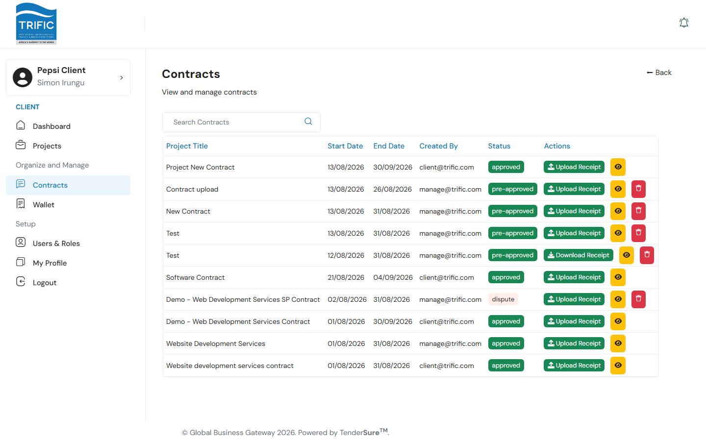
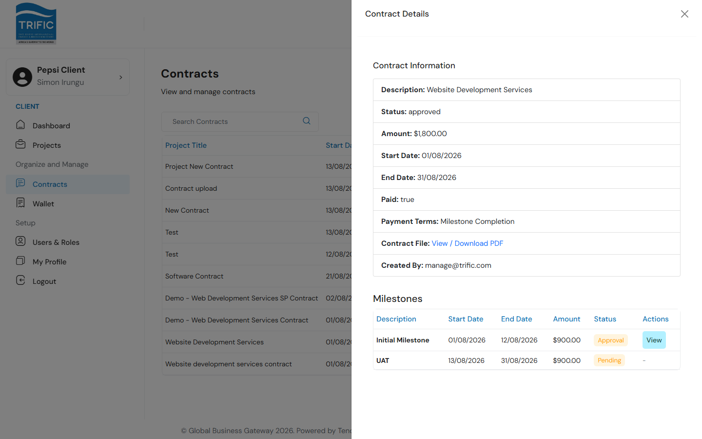
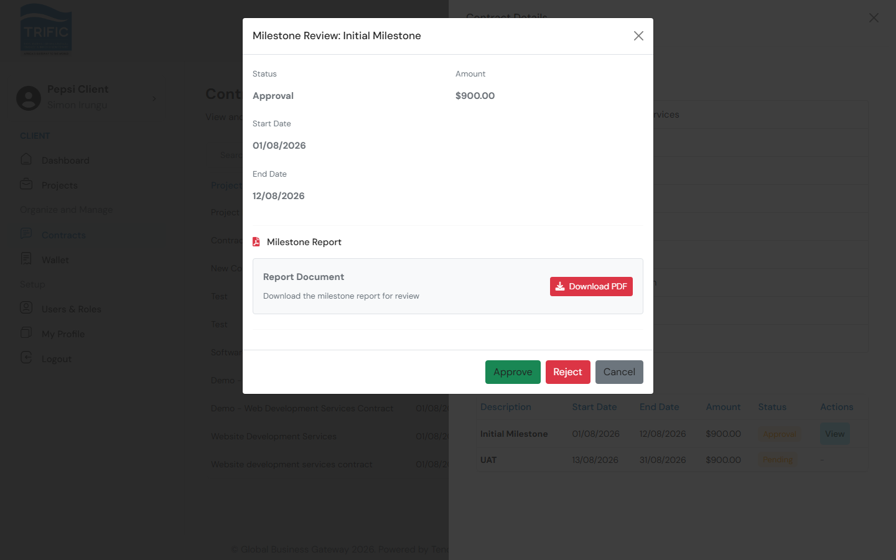
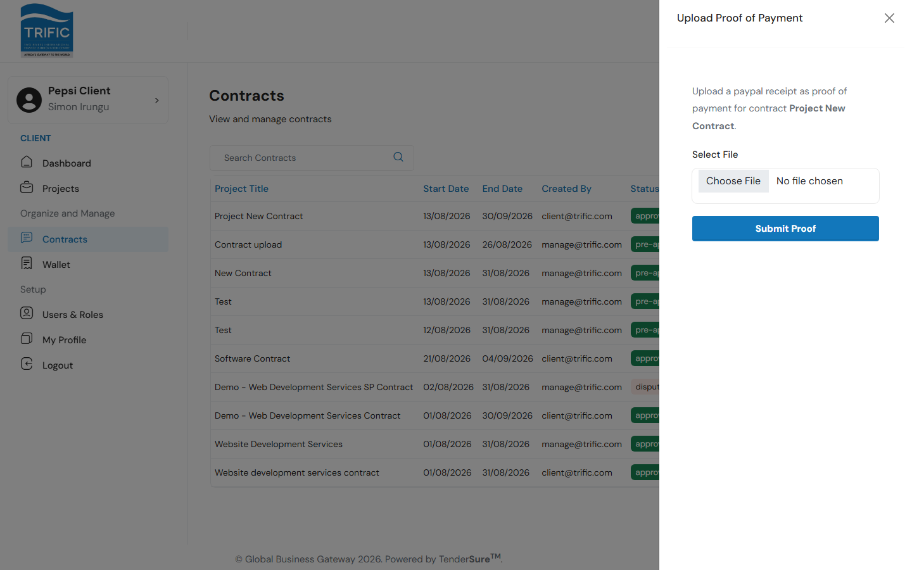

# Contracts & Milestones

The **Contracts** page (left menu → **Contracts**) lists every contract across all of your projects in one place, with tools to inspect terms, track milestones, and manage payment proof. This is separate from the read-only **Contract** tab you see inside an individual project's detail panel (covered in [Creating a Project](creating-a-project.md)) — that tab shows one project's contract; this page shows all of them together.

## 1. The Contracts list

| Column | Notes |
|---|---|
| **Project Title** | Shown as the contract's description. |
| **Start Date / End Date** | Contract term. |
| **Created By** | Email of whoever created the contract (you, or Management). |
| **Status** | `pre-approved`, `approved`, or `dispute`. |
| **Actions** | Upload/Download Receipt, View Details, and (for non-approved contracts) Delete. |

You can search contracts by keyword using the search box above the table.

A contract can only be **deleted** while its status is not `approved`.

## 2. Viewing contract details

Click the eye icon (**View Details**) on any row to open the Contract Details panel:

| Field | Notes |
|---|---|
| **Description** | The contract's title/description. |
| **Status** | Current approval status. |
| **Amount** | Total contract value. |
| **Start Date / End Date** | Contract term. |
| **Paid** | Whether the escrow deposit has been made. |
| **Payment Terms** | One of **Upfront**, **Milestone Completion**, or **Project Completion** — set when the contract was created. |
| **Contract File** | Link to view/download the signed contract PDF. |
| **Created By** | Who created the contract. |

If the contract's payment terms are **Milestone Completion**, a **Milestones** table appears underneath with each milestone's description, dates, amount, and status.

## 3. Reviewing a milestone

Milestone statuses are `Pending`, `Approval`, `Completed`, or `Declined`. A milestone reaching your Contracts page isn't a direct hand-off from the service provider — it passes through Management first:

1. The service provider submits their completed work against the milestone.
2. **Management reviews it first** and approves it on their side.
3. Only after Management's approval does the milestone's status move to `Approval` here and a **View** action appear for you — this is your final sign-off before payment is released.

Click **View** to open the Milestone Review panel:

The panel shows the milestone's status, amount, start/end dates, and — if the service provider attached one — a **Milestone Report** PDF you can download before deciding. From here you can:

- **Approve** — gives your final sign-off. This is what allows Management to include the milestone in a payment batch (see the Management guide's [Payments & Commissions](../management/payments-and-commissions.md)).
- **Reject** — sends it back as declined.
- **Cancel** — closes the panel without action.

## 4. Payment proof

Each contract row has an **Upload Receipt** / **Download Receipt** action:

- If no proof of payment has been uploaded yet, click **Upload Receipt** to open a panel where you attach a PayPal receipt (image or PDF) as evidence of your escrow deposit.
- Once a receipt exists, the button becomes **Download Receipt**, letting you (or Management) retrieve it later.

## 5. How a contract gets its escrow deposit

The escrow deposit itself isn't initiated from this page — it happens from inside the project it belongs to:

1. Once Management approves a project's contract terms, a **"Pay $&lt;amount&gt;"** button appears on the project's **Contract** tab.
2. Clicking it opens PayPal checkout. On completion you're redirected back into the app, where the payment is captured and the contract's **Paid** status flips to `true`.
3. If a contract is disputed by Management (status `dispute`), you can **Edit Terms** and resubmit — this updates the description, dates, amount, contract file, and payment terms, then sends it back for review.

For the full walkthrough of creating a contract from a project and making that first deposit, see [Creating a Project](creating-a-project.md) and [Payments & Wallet](payments-and-wallet.md).
