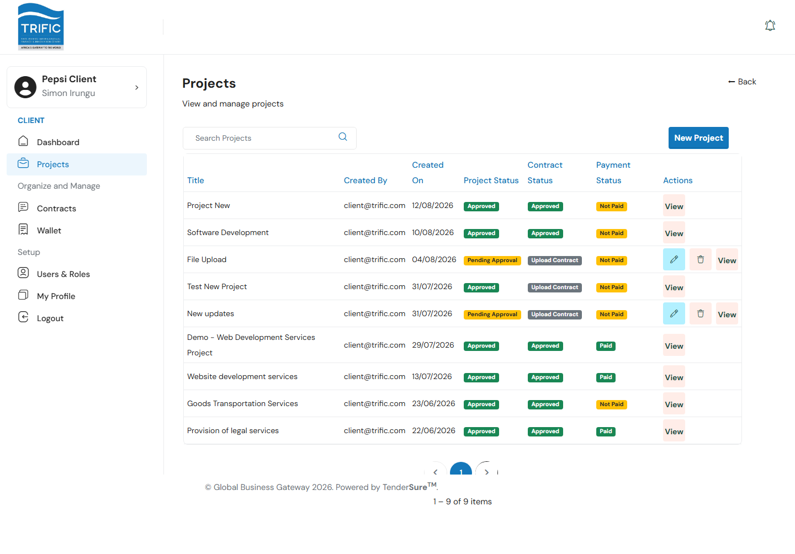
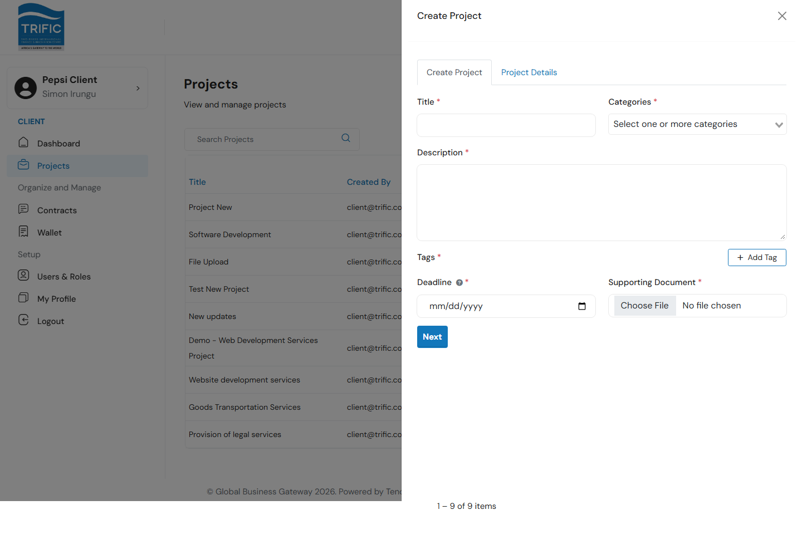
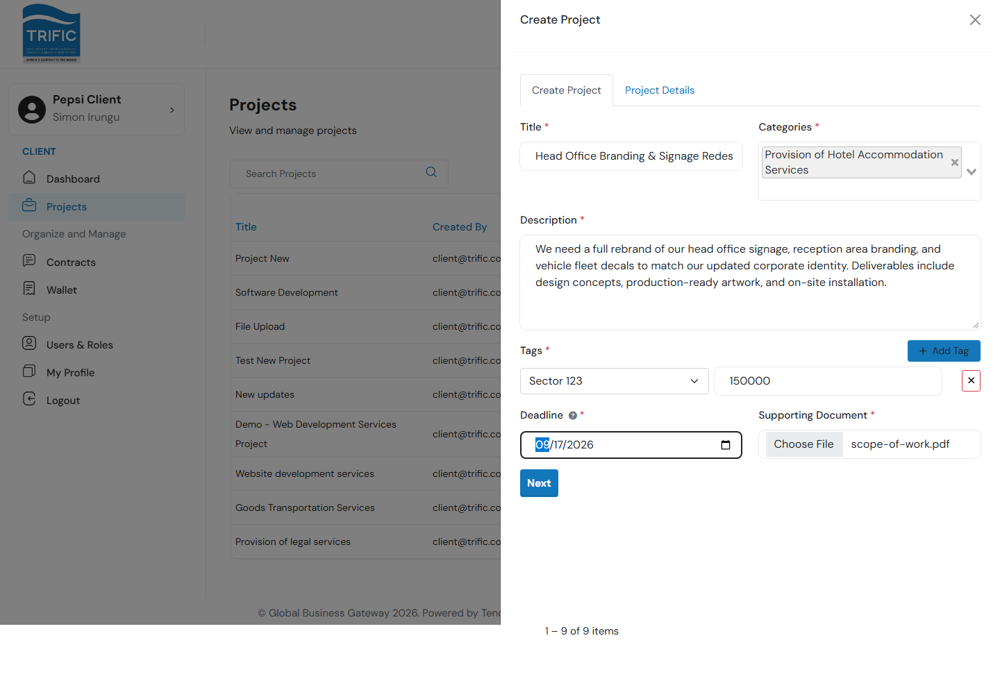
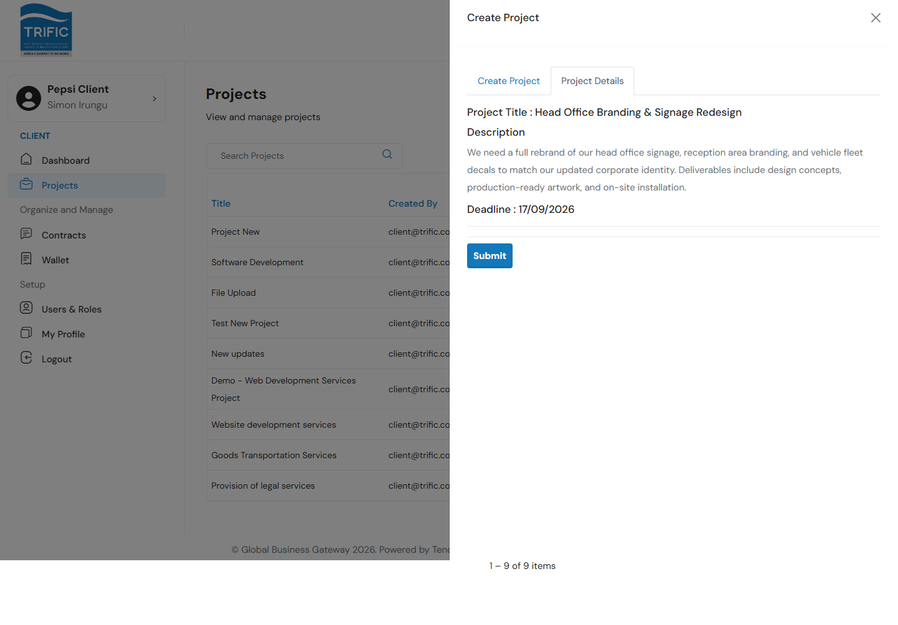
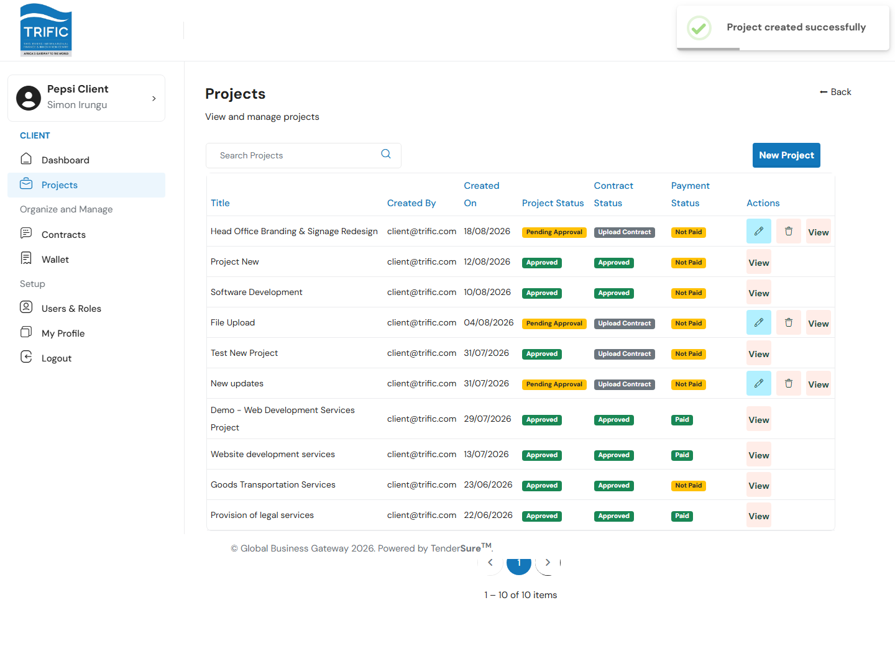
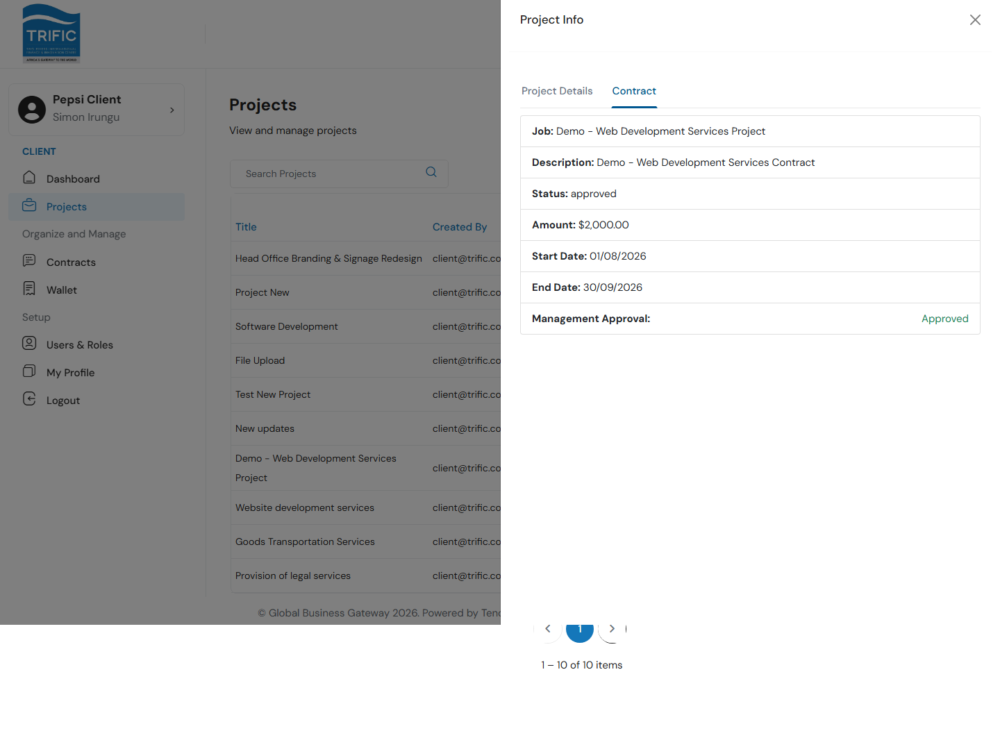

# Creating a Project

Every piece of work a Client procures on Trific starts as a **Project**. This is the entry point to the platform's core workflow:

**Project → Management Approval → Contract → Contract Approval & Payment → Service Provider delivers work**

This guide walks through creating a project from scratch.

## 1. Open the Projects page

From the left-hand menu, select **Projects**. This page lists every project your company has created, along with three status columns that track where each one is in the pipeline:

- **Project Status**: `Pending Approval` or `Approved` by Trific Management
- **Contract Status**: `Upload Contract` (none yet) or `Approved`
- **Payment Status**: `Not Paid` or `Paid`

## 2. Start a new project

Click **New Project** in the top-right corner. A panel opens with two tabs: **Create Project** and **Project Details**.

Fill in the **Create Project** tab:

| Field | Notes |
|---|---|
| **Title** | A short, descriptive name for the work. |
| **Categories** | One or more service categories this work falls under (e.g. "Provision of Hotel Accommodation Services"). This determines which vetted service providers are eligible for the job later. |
| **Description** | What you need done. Minimum 20 characters. |
| **Tags** | Structured metadata about the project: click **+ Add Tag**, pick a tag type, and enter its value. At least one tag is required. |
| **Deadline** | The date by which you expect the project to be assigned a service provider. Must be today or later. |
| **Supporting Document** | A file backing up the request (e.g. scope of work, drawings). **Only these file types are accepted: PDF, DOC, DOCX, JPG, PNG, JPEG, XLSX, XLS, ZIP, RAR**. Anything else (including plain `.txt`) is rejected by the server with a 400 error. |

## 3. Review and submit

Click **Next**: the form validates all required fields client-side before letting you continue. On the **Project Details** tab you get a read-only summary of the title, description, and deadline.

Click **Submit** to create the project.

The new project immediately appears in your Projects list with:
- **Project Status:** Pending Approval
- **Contract Status:** Upload Contract
- **Payment Status:** Not Paid

## 4. What happens next

A newly submitted project is not yet active work. It must clear two approval gates before a service provider starts:

1. **Management reviews and approves the project.** Until this happens, the project stays in `Pending Approval` and cannot be edited into a contract.
2. **A Contract is created against the project** (either by you or by Management), capturing the commercial terms: the job it's for, a description, the contract **Amount**, and **Start/End dates**. This contract also needs **Management Approval** before it's binding.

You can check a project's contract terms at any time by clicking **View** on a project row, then switching to the **Contract** tab in the side panel:

Once the contract is approved, payment (deposit) can be made (see [Payments & Wallet](payments-and-wallet.md)) and the Payment Status column updates to `Paid`.

## Editing or deleting a project

You can only **Edit** or **Delete** a project while it is still `Pending Approval`. Once Management approves it, those actions disappear from the row and the project becomes read-only from the Projects list (further changes happen through the contract and milestone workflow instead).
