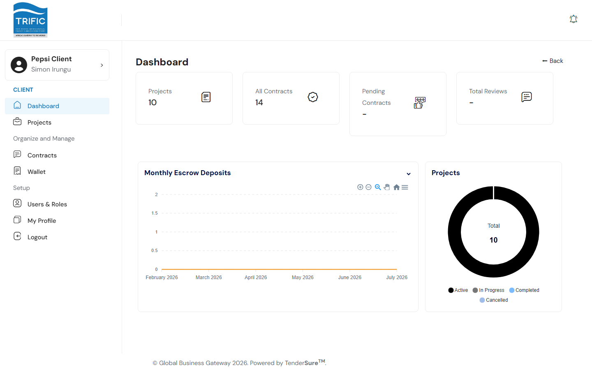

# Dashboard

The Dashboard is the first screen you land on after logging in. It gives you a quick, at-a-glance summary of your company's activity on Trific before you drill into Projects, Contracts, or Wallet.

## Stat cards

Across the top of the page are four summary cards:

| Card | What it shows |
|---|---|
| **Projects** | Total number of projects your company has created. |
| **All Contracts** | Total number of contracts across all your projects. |
| **Pending Contracts** | Intended to show contracts awaiting approval. |
| **Total Reviews** | Intended to show the number of reviews left for service providers you've worked with. |

**Note:** in the current build, only the **Projects** and **All Contracts** counts are wired up to live data. The "Pending Contracts" and "Total Reviews" cards, and the small "New Completed" / "New Reviews" badges under each card, are still placeholders and don't reflect real counts yet. Don't rely on them for reporting.

## Charts

Below the stat cards are two charts:

- **Monthly Escrow Deposits**: an area chart plotting the total value of escrow deposits your company has made, by month.
- **Projects**: a donut chart breaking your total project count down by status: Active, In Progress, Completed, and Cancelled.

Both charts pull from live data (escrow deposit history and project status counts respectively), so they're a reliable quick read on where your work stands.

## Where to go next

- To see the full list of projects behind the "Projects" card, use the **Projects** link in the left-hand menu (see [Creating a Project](creating-a-project.md)).
- To see the full list of contracts, go to **Contracts**: see [Contracts & Milestones](contracts-and-milestones.md).
- To see escrow balances and payment history behind the deposits chart, go to **Wallet**: see [Payments & Wallet](payments-and-wallet.md).
