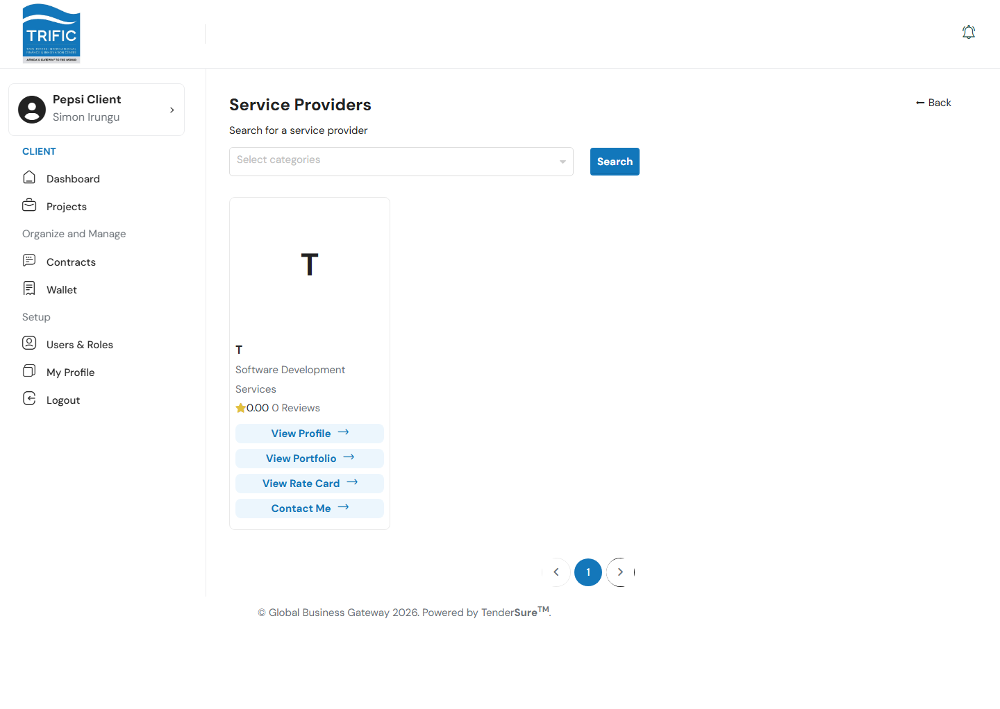
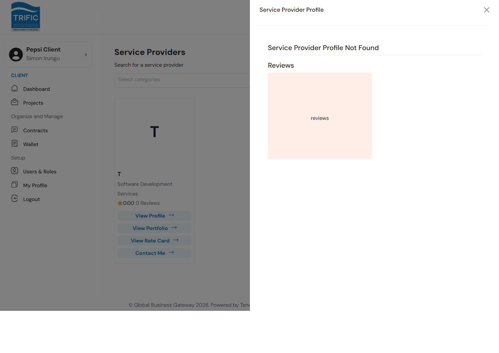

# Finding Service Providers

Before you invite a company to work on a project, you can browse Trific's pool of vetted Service Providers, filter them by category, and review their profile, portfolio, rate card, and past reviews.

**Note:** this page isn't currently linked from the left-hand menu. You reach it either by navigating directly to `/client/service-providers`, or automatically when you invite providers to a specific job (in which case the page carries a `job_id` and `category_id` and every provider card offers **Invite** instead of **Contact Me**).

## 1. Search for providers

On the Service Providers page, use the **Select categories** dropdown to filter by one or more service categories (the same category tree used when creating a project). Type to search for a category, pick one or more, then click **Search**.

Each result card shows the provider's company name, category, star rating, and review count.

## 2. View a provider's details

Each card offers four actions:

| Action | What it does |
|---|---|
| **View Profile** | Opens the provider's uploaded profile document in a side panel, plus their rating breakdown and written reviews from past clients. |
| **View Portfolio** | Opens the provider's uploaded portfolio document in the same panel. |
| **View Rate Card** | Opens the provider's uploaded rate card document. |
| **Contact Me** (or **Invite**, when reached from a job) | Sends the provider an opening message and takes you to your Messages inbox. |

If a provider hasn't uploaded the document you're viewing (profile, portfolio, or rate card), the panel tells you it wasn't found rather than failing silently. This is normal for providers who haven't finished setting up their profile yet.

## 3. Reach out to a provider

Clicking **Contact Me** / **Invite** sends a pre-filled opening message:
- Outside a job context: *"Hello, I would like to discuss a potential project with you."*
- Inside a job context (invited from a job): *"Hello, I would like to invite you to apply for a job."*

You're then taken to **Messages**, where the conversation continues: see [Messaging, Reviews & Archive](messaging-reviews-archive.md).
