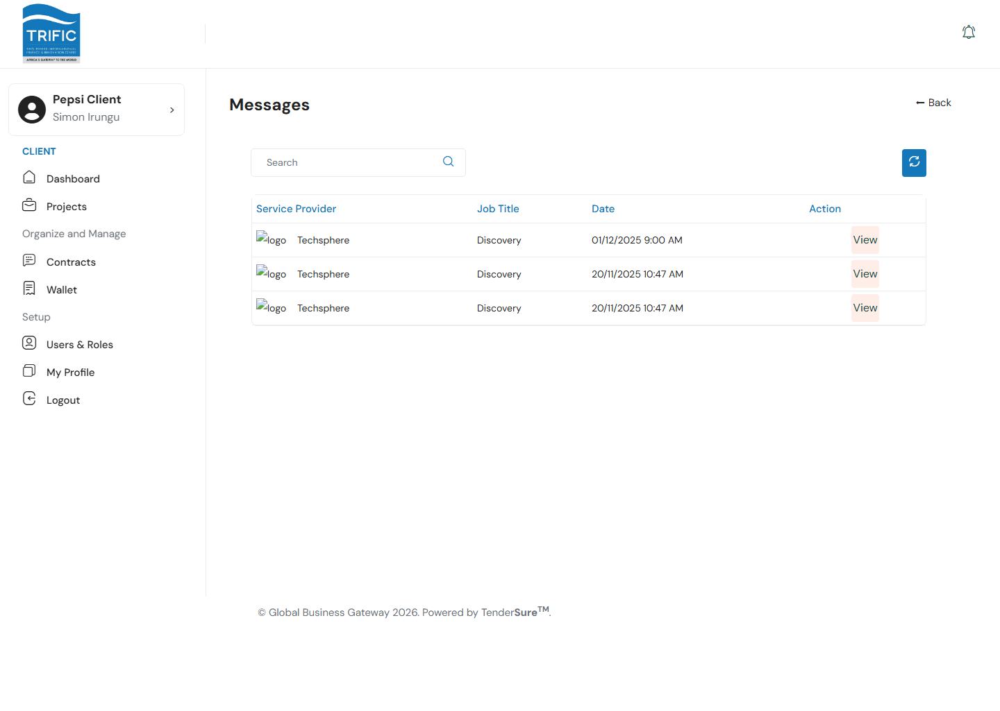
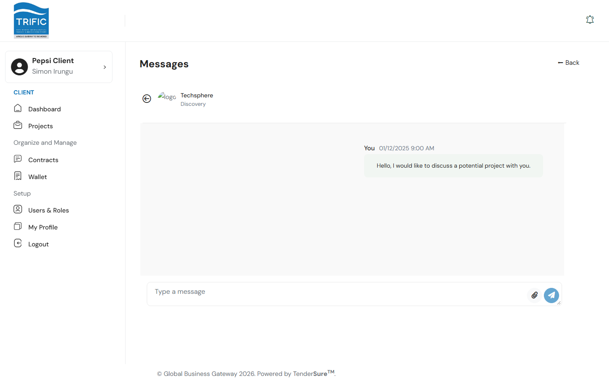
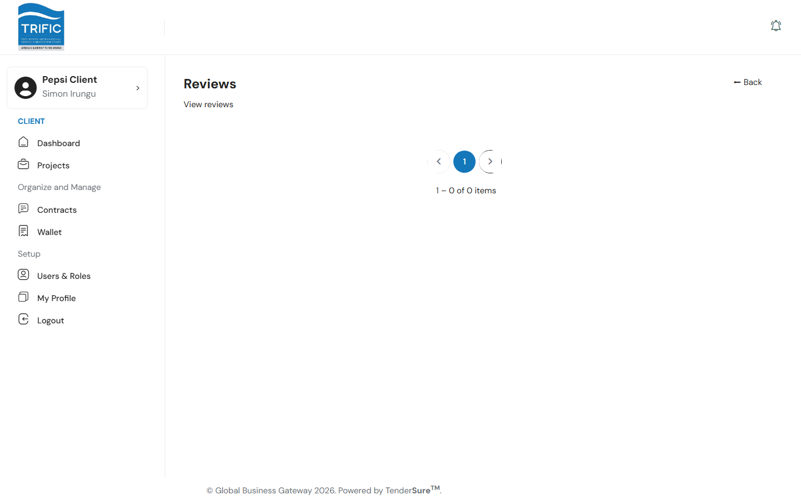

# Messaging, Reviews & Archive

Three smaller features round out the Client portal: direct messaging with service providers, viewing reviews, and (in a future release) an archive of category-specific documents per contract.

## Messages

Reach Messages either directly at `/client/messages`, or automatically after clicking **Contact Me** / **Invite** on a service provider's card (see [Finding Service Providers](finding-service-providers.md)) — it isn't currently listed in the left-hand menu itself.

The inbox lists every conversation thread you have with a service provider, showing their name, the related job title, and the date of the last message.

Click **View** on a thread to open the conversation. From here you can read the full message history and reply — the composer supports plain text and file attachments (via the paperclip icon).

## Reviews

Reach Reviews directly at `/client/reviews` (also not currently in the left-hand menu). This page lists reviews related to your company's jobs — reviewer, job title, star rating, date, and comment text.

Each review has a **Respond** action that opens a panel where you can write a message back and optionally tick **Raise Complaint** if you want to flag the review for Trific's attention.

**Related:** you leave a review for a service provider (rather than receive one) from inside a contract's detail panel, via a "Submit Review & End Contract" step tied to closing out a contract — in the current build the button that opens this flow is not yet exposed in the Contract Details UI.

## Archive

The Archive is **not currently accessible** in this build — its route is disabled in the app's router, and navigating to `/client/archive` loads a blank page. Based on the underlying code, when enabled it's intended to show, per contract, a checklist of category-specific compliance documents the service provider has attached (a document name plus a download link, or "Not Attached" if missing) — useful for confirming a service provider supplied everything your project's category requires. There's nothing to configure or act on here today.
