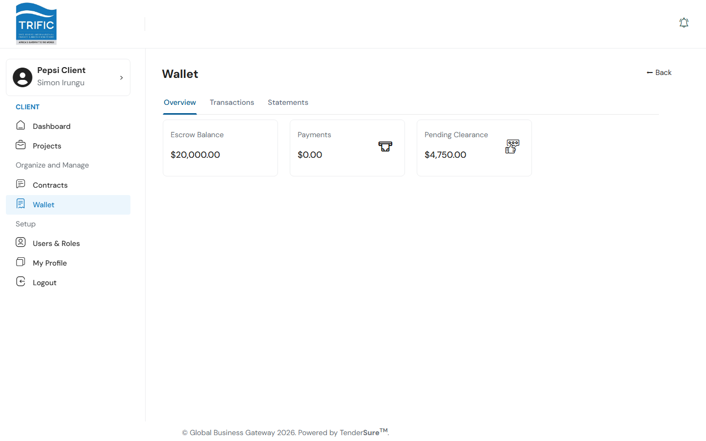
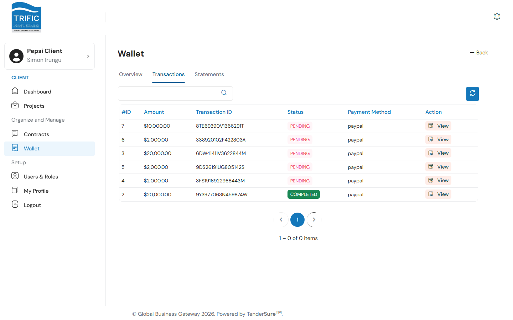
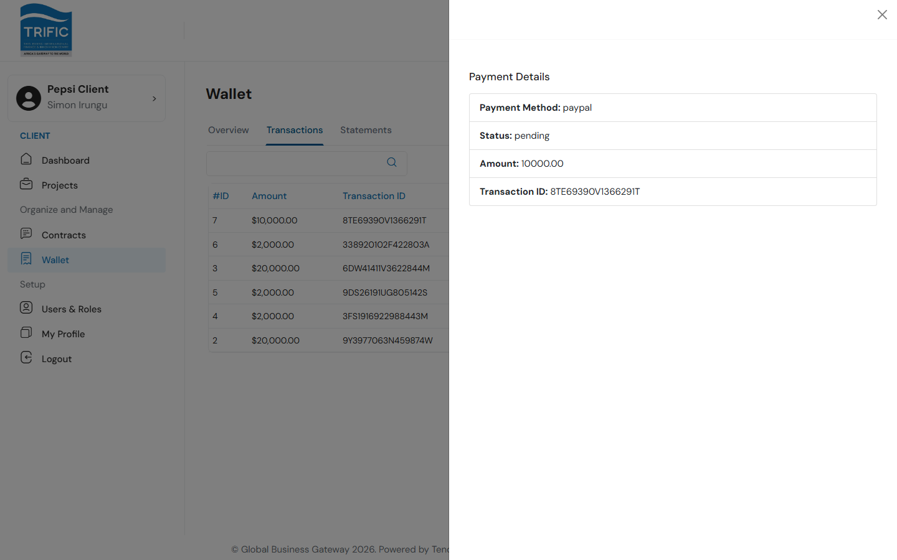
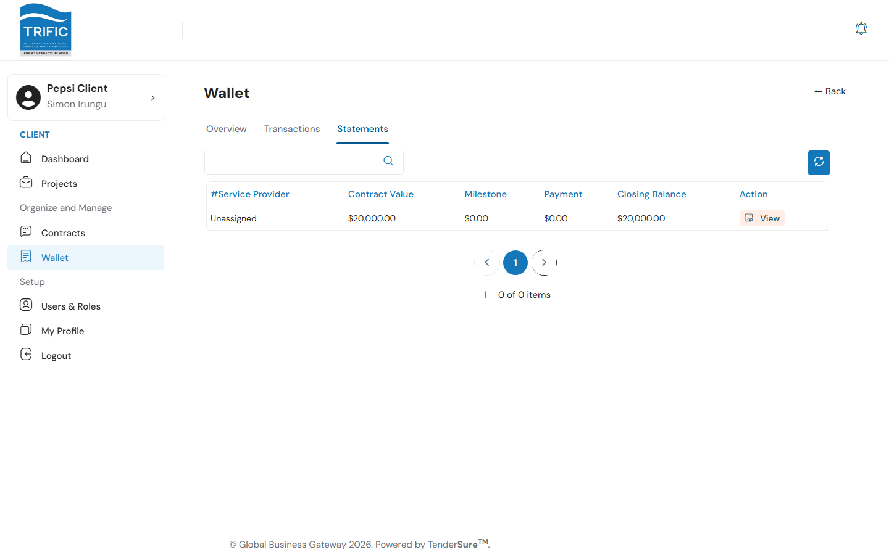
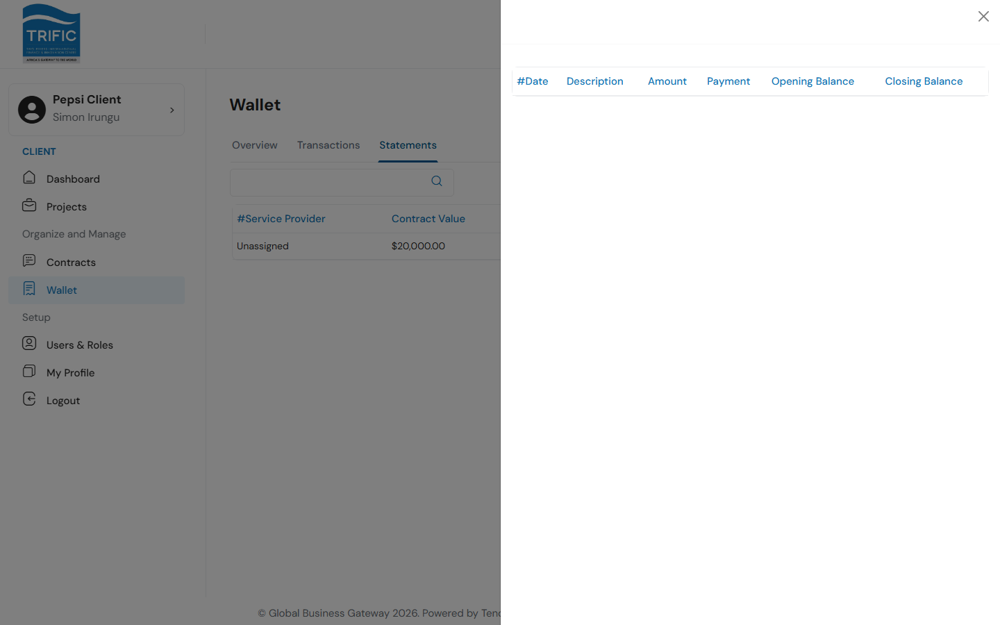

# Payments & Wallet

The **Wallet** page (left menu → **Wallet**) is where you track escrow funds, review every payment your company has made, and pull statements per service provider. It has three tabs: **Overview**, **Transactions**, and **Statements**.

## 1. Overview

| Stat | Meaning |
|---|---|
| **Escrow Balance** | Total funds currently held in escrow across all your contracts. |
| **Payments** | Total amount already paid out to service providers. |
| **Pending Clearance** | Amount deposited but not yet cleared/released. |

There is no standalone "top up" or "fund wallet" button. The wallet's escrow balance is built up entirely from the deposits you make against individual contracts (see below). You can't pre-fund the wallet independently of a contract.

## 2. Making a deposit payment

Escrow deposits are initiated from a project's **Contract** tab, not from the Wallet page itself:

1. A contract must first be created and approved by Management, with **Payment Terms** set to one of **Upfront**, **Milestone Completion**, or **Project Completion**.
2. Once approved, a **"Pay $&lt;amount&gt;"** button appears on the project's Contract tab.
3. Clicking it starts a PayPal checkout for the full contract amount. After you approve payment on PayPal, you're redirected back into the app.
4. The app captures the payment automatically and shows a **Payment Successful** confirmation, after which the contract's **Paid** flag and the Wallet's Escrow Balance both update.

If PayPal redirects back before the payment finishes processing, you'll land on a **Payment Processing** screen that polls the payment status every few seconds (for up to ~2.5 minutes) and shows one of four outcomes: **Success**, **Processing**, **Failed**, or **Status Unknown** (with a manual **Check Status Again** option and a link to contact support if you were charged without confirmation).

For the full contract-creation flow, see [Contracts & Milestones](contracts-and-milestones.md) and [Creating a Project](creating-a-project.md).

## 3. Transactions

The **Transactions** tab lists every payment record: ID, amount, transaction ID, status (`PENDING` / `COMPLETED`), and payment method.

Click **View** on any row to see its full detail (payment method, status, amount, and transaction ID) in a side panel.

## 4. Statements

The **Statements** tab summarizes escrow activity per service provider: contract value, milestone value invoiced so far, total payments made, and the resulting closing balance.

Click **View** on a row to drill into that contract's itemized statement: a running ledger of each milestone/payment entry with its date, description, amount, payment value, and opening/closing balance.

