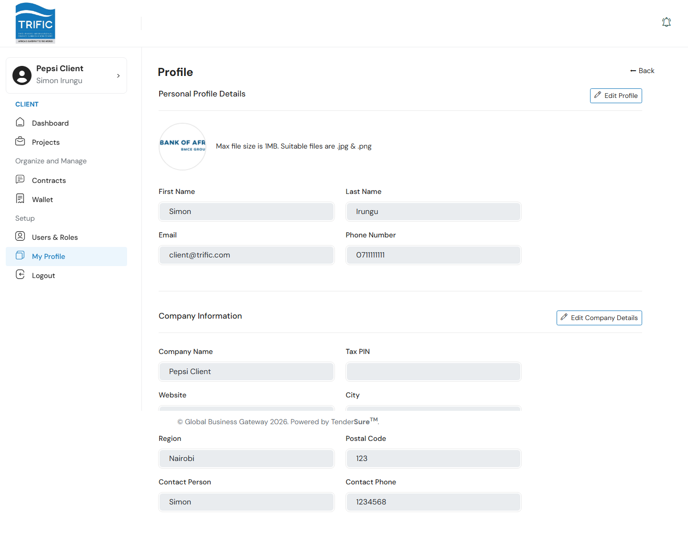
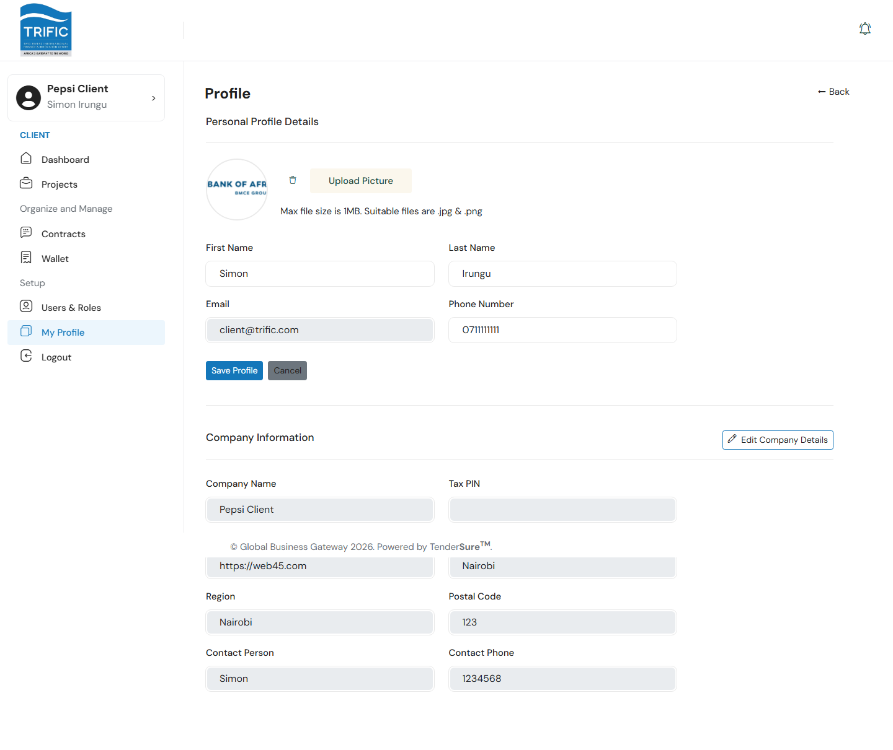
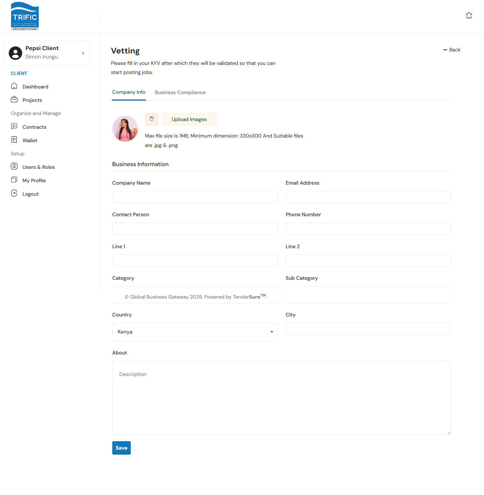
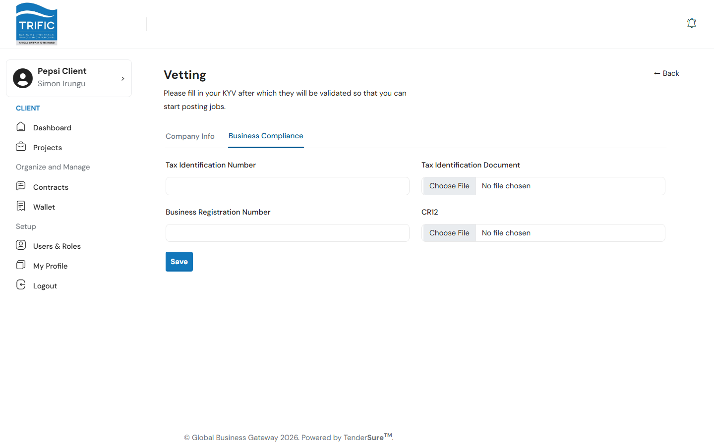

# My Profile & Business Compliance

This page covers two related but separate screens: **My Profile**, where you manage your own account details and your company's public information, and the **KYC / Business Compliance** ("Vetting") screen, where your company submits the documents Global Business Gateway needs to verify it.

## My Profile

Left menu → **My Profile** (`/client/users-profile`). The page has two independently-editable sections.

### Personal Profile Details

Click **Edit Profile** to unlock the fields:

| Field | Notes |
|---|---|
| **First Name / Last Name** | Required. |
| **Email** | Always read-only: you cannot change your login email from this screen. |
| **Phone Number** | Optional. |
| **Profile Picture** | Optional avatar. Max file size **1MB**; **.jpg** or **.png** only. Use **Upload Picture** to replace it or the trash icon to remove it. |

Click **Save Profile** to commit changes, or **Cancel** to discard them and revert the form.

### Company Information

Click **Edit Company Details** to unlock a second, independent form covering: **Company Name**, **Tax PIN**, **Website**, **City**, **Region**, **Postal Code**, **Contact Person**, and **Contact Phone**, all required once you're editing. The **Website** field is validated client-side (must be a real `http(s)://` domain with a dot in it; `localhost` is rejected) before it will save.

## Business Compliance (KYC / Vetting)

This screen isn't currently linked from the left-hand menu. Reach it by navigating directly to `/client/kyc`. Its purpose, per the in-app description, is direct: **"Please fill in your KYV after which they will be validated so that you can start posting jobs."** In other words, this vetting information is what Global Business Gateway management reviews to approve your company before you can post projects.

It has two tabs: **Company Info** and **Business Compliance**.

### Company Info

Fields include Company Name, Email Address, Contact Person, Phone Number, address Line 1/Line 2, Category, Sub Category, Country, City, and an About/summary text area. Click **Save**: this also automatically advances you to the **Business Compliance** tab.

### Business Compliance

| Field | Notes |
|---|---|
| **Tax Identification Number** | Text field. |
| **Tax Identification Document** | File upload. |
| **Business Registration Number** | Text field. |
| **CR12** | File upload (Kenyan company registration document). |

Click **Save** to submit. Both tabs save independently of each other; you don't need to fill out Company Info before Business Compliance will accept a submission.
