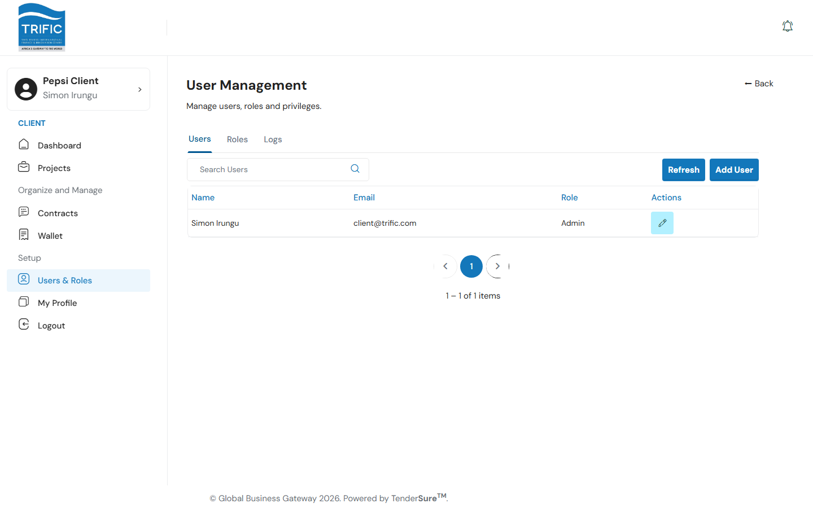
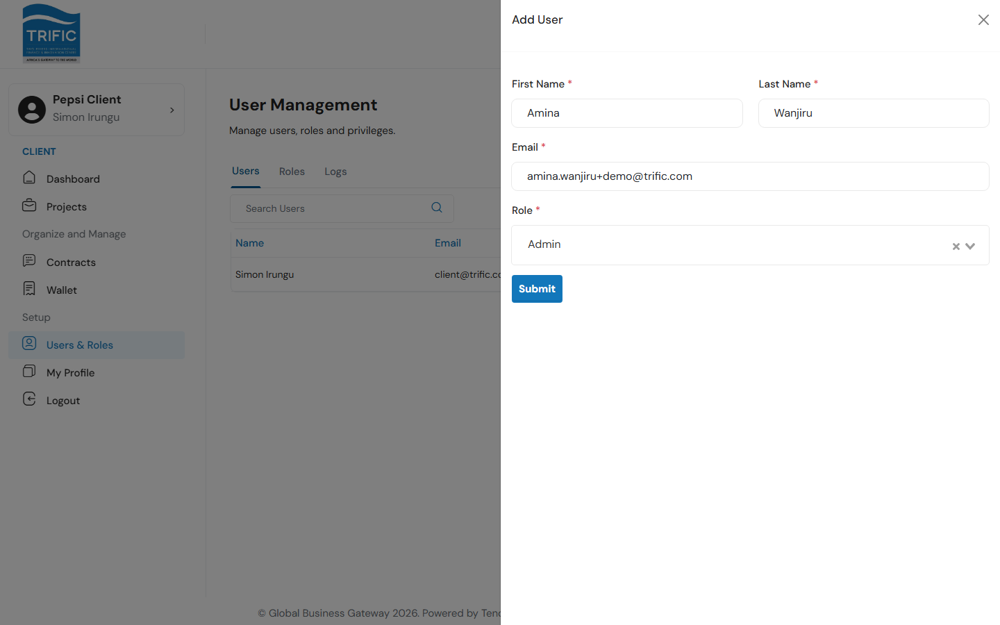
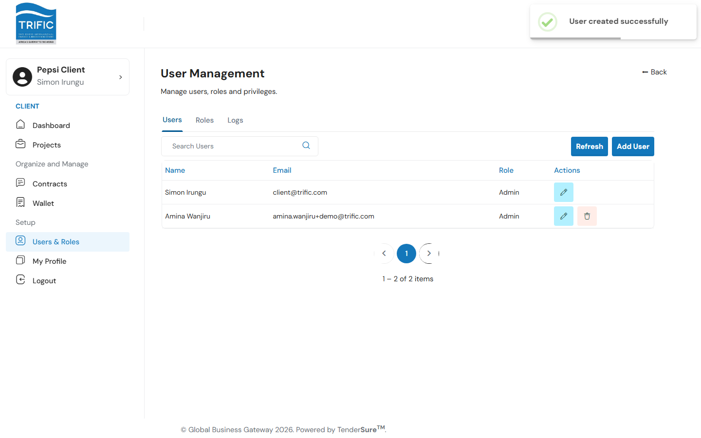
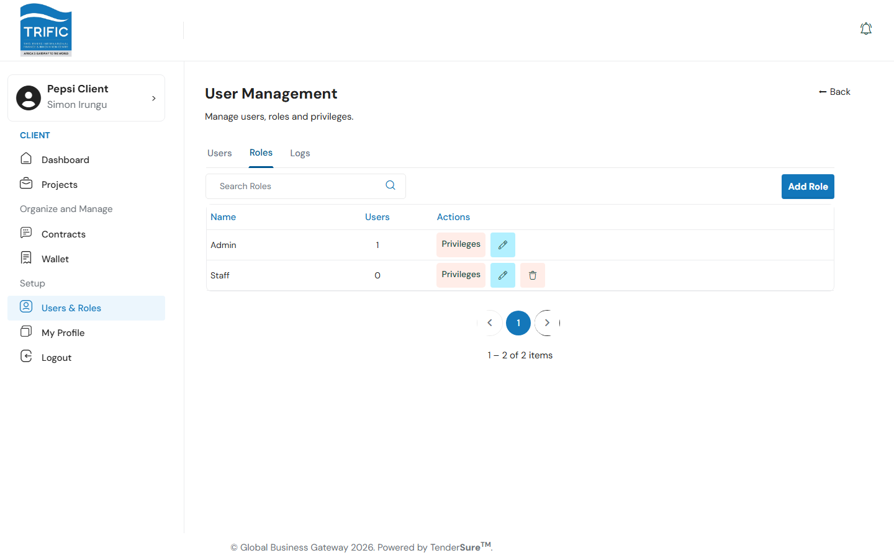
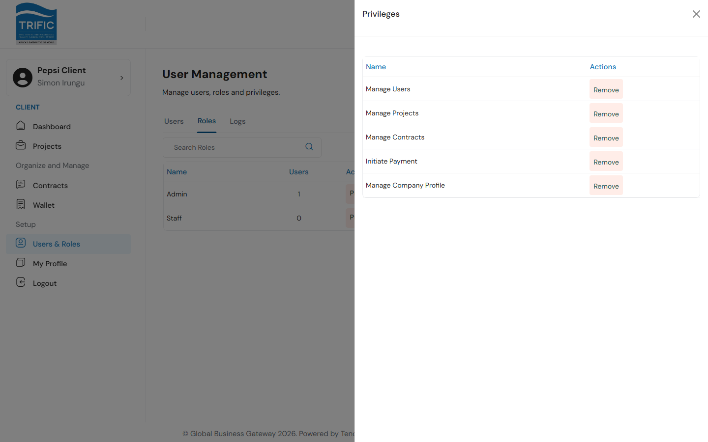
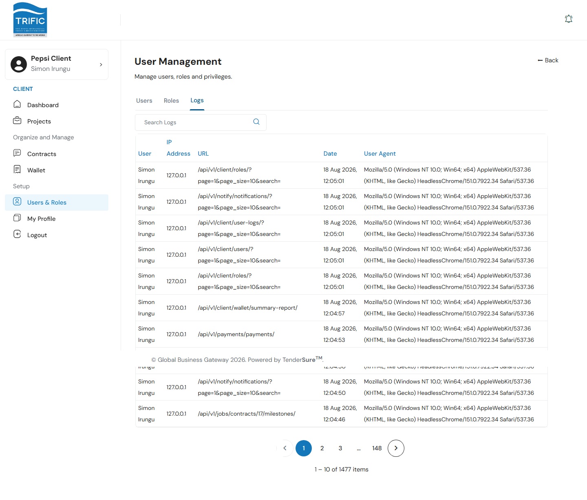

# Users & Roles

As a company admin, use **Users & Roles** (left menu → **Users & Roles**) to invite teammates into your company's Trific account and control what each of them can do, via three tabs: **Users**, **Roles**, and **Logs**.

## 1. Adding a user

On the **Users** tab you'll see everyone currently on your company account, with their name, email, and assigned role.

Click **Add User** to open the panel and fill in:

| Field | Notes |
|---|---|
| **First Name** | Required. |
| **Last Name** | Required. |
| **Email** | Required: this becomes their login. |
| **Role** | Required: pick from your company's existing roles (see below). |

Click **Submit**. The new user appears in the list immediately.

To edit a user later, click the pencil icon on their row. You can delete any user except yourself (the delete icon is hidden on your own row).

## 2. Roles

Switch to the **Roles** tab to see every role defined for your company, along with how many users currently hold each one.

- **Add Role** opens a panel where you name the new role, then **Submit**.
- The pencil icon lets you rename an existing role.
- A role can only be **deleted** if it has zero users assigned and isn't the built-in **Admin** role.

## 3. Assigning privileges to a role

Click **Privileges** on any role to open its privileges panel. Each privilege can be individually **Assign**ed or **Remove**d (the link shown depends on whether the role already has it).

The privileges available mirror what unlocks in the left-hand menu for anyone holding that role:

| Privilege | Unlocks |
|---|---|
| **Manage Users** | The Users & Roles menu item. |
| **Manage Projects** | The Projects menu item. |
| **Manage Contracts** | The Contracts menu item. |
| **Initiate Payment** | The Wallet menu item. |
| **Manage Company Profile** | Editing company details on My Profile. |

A user without any of these privileges on their role will see a much shorter left-hand menu than an Admin.

## 4. Logs

The **Logs** tab is a read-only audit trail of API activity on your company's account: which user made a request, from what IP address, to which endpoint, and when.

Use it to answer "who did what, and when" if you need to trace an action back to a specific teammate.
