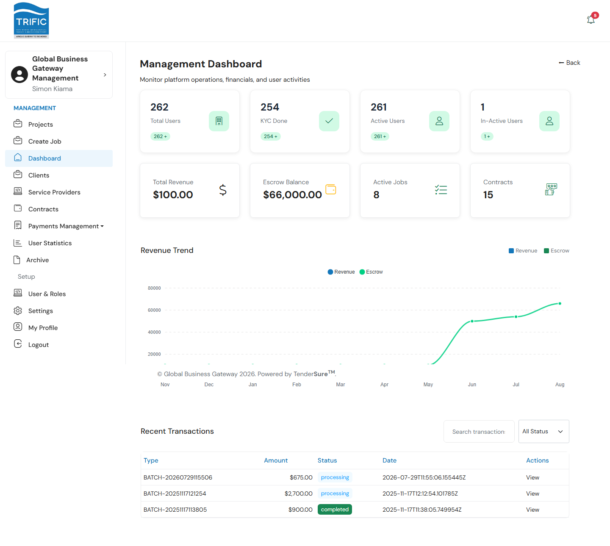

# Dashboard

The Management Dashboard is the landing page for Trific's internal ops/finance staff. It gives a single-page snapshot of platform activity — user growth, revenue, escrow, and the health of the payment pipeline — before you drill into a specific area of the portal.

## What you see

When you log in to the Management portal you land on **Dashboard** in the left-hand menu. The page is built from four sections, top to bottom:

1. **User Statistics row** — a row of stat cards pulled from the platform's user base (total users, KYC completion, active/inactive users, etc.).
2. **KPI cards** — four headline figures:

   | Card | What it shows |
   |---|---|
   | **Total Revenue** | Total revenue recognized on the platform, formatted as USD. |
   | **Escrow Balance** | Funds currently held in escrow awaiting release. |
   | **Active Jobs** | Count of jobs currently open/in progress. |
   | **Contracts** | Total number of contracts on the platform. |

3. **Revenue Trend chart** — a line chart plotting **Revenue** and **Escrow** month over month.
4. **Recent Transactions table** — the most recent payment batches, with columns for Type (batch ID), Amount, Status (pending/approved/rejected/settled), Date, and a **View** link that jumps to Payments Management.

## Notes

- The Recent Transactions table can be filtered by a search box and a Status dropdown (All / Pending / Approved / Rejected / Settled), though filtering happens against the batch data shown here rather than re-querying the server.
- Every "View" link in the transactions table routes to **Payments Management** (`/management/payments`) since these rows represent service-provider payment batches, not individual jobs.
- The Dashboard is read-only — it's an overview, not a working screen. Use the left-hand menu to act on any of the figures shown here (e.g. go to **Contracts** to actually approve a contract, or **Payments Management** to act on a batch).
