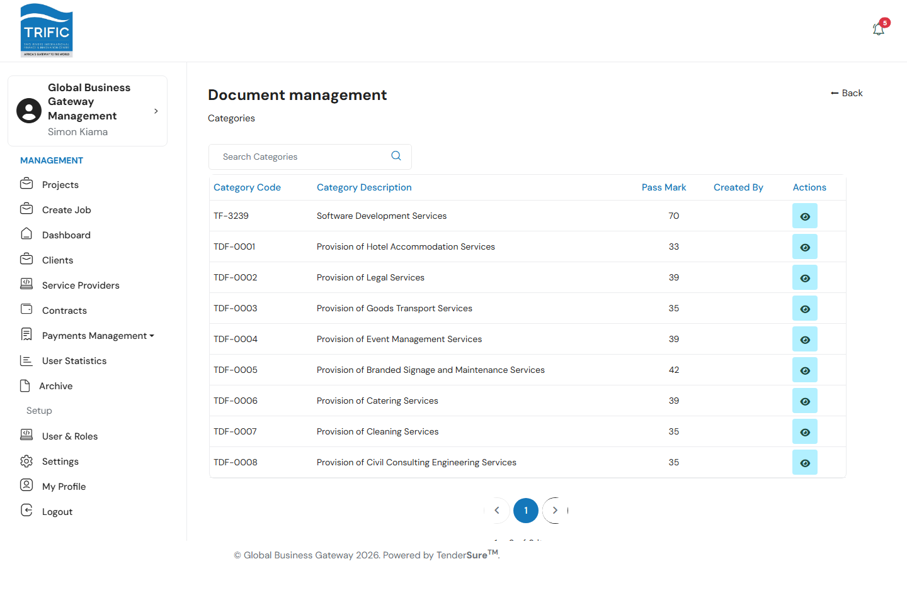
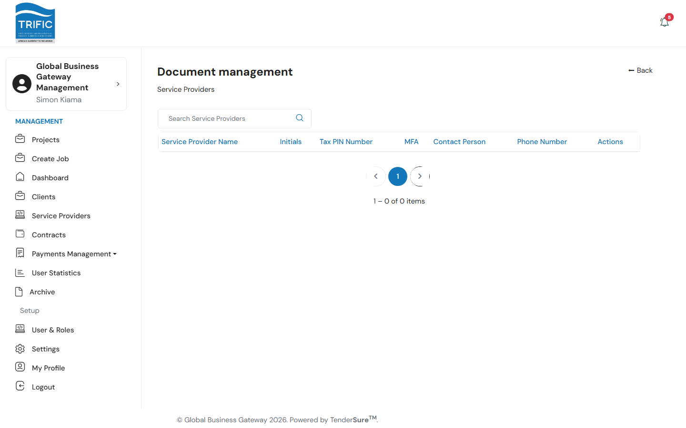

# Document Archive

The **Archive** page is Management's read-only view into the documents Service Providers have submitted as part of their prequalification/vetting process — organized by category, then by provider. It exists so Management can look up a provider's submitted paperwork without needing access to the separate TenderSure Admin portal, which owns the actual vetting decision.

## 1. Categories

Open **Archive** from the left-hand menu (`/management/document-management`). You land on a list of vetting **Categories** — the service categories Service Providers register under — each with a Category Code (e.g. `TDF-0001`), Category Description (e.g. "Provision of Hotel Accommodation Services"), and Pass Mark.

## 2. Service Providers within a category

Click the eye icon on a category to drill into every Service Provider registered under it, with the same company columns used elsewhere in the portal (Name, Initials, Tax PIN Number, MFA, Contact Person, Phone Number).

## 3. A provider's documents

Click through to a specific provider to see two things:

- **Service Provider Reports** — generated report documents for that provider (e.g. a scoring/evaluation report), each with a **Download** link, or "Not available" if none has been generated.
- **Service Provider Documents** — every individual document the provider submitted for that category (a short description plus a **Download** link to their uploaded response), searchable and paginated.

This drill-down path — Category → Service Provider → Documents — mirrors how the vetting categories are structured in the TenderSure Admin portal, but here it is strictly a browsing/archive view: Management can look at what was submitted, but cannot score, approve, or reject it from this screen.
