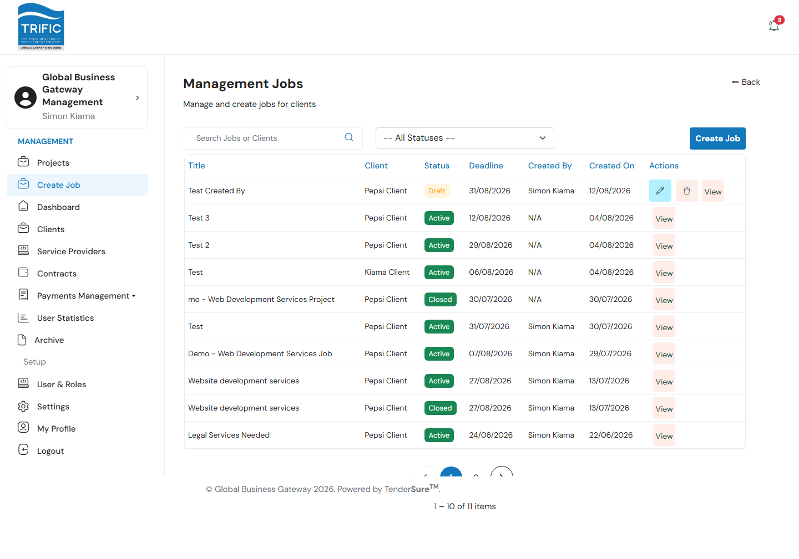
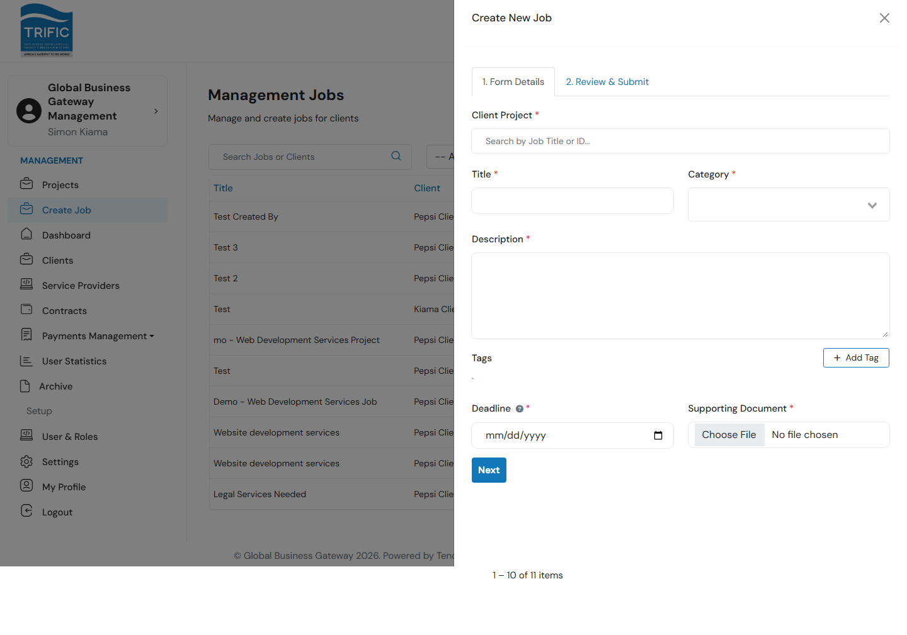
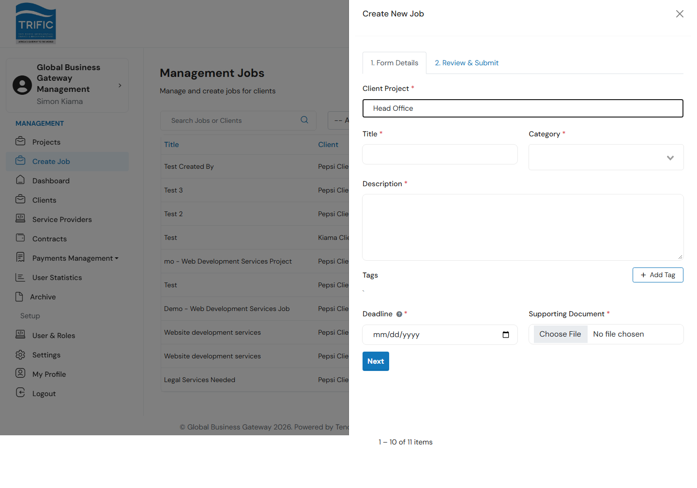

# Jobs & Create Job

"Create Job" is the nav label, but what it actually opens is the **Management Jobs** list — every Job on the platform, plus the ability to create a new one. A **Job** is a distinct object from a **Project**: a Project is the Client's original request; a Job is what actually gets posted so Service Providers can submit proposals against it. Management creates Jobs **on behalf of a Client**, always linked back to one of that Client's existing (and already-approved) Projects — Management does not invent work out of nothing.

**Where this fits in the pipeline:** you create a Job once a Project has cleared both approval gates and the Client has paid their deposit (see [Reviewing & Approving Projects and Contracts](reviewing-projects-and-contracts.md)). From here, the sequence continues: open the Job → Service Providers submit Proposals → you close the Job and pick a winner → you create a Service-Provider-specific Contract for them (covered at the end of this page).

## 1. Open the Jobs list

Open **Create Job** from the left-hand menu. You'll see every job across all Clients, with Title, Client, Status (Draft/Active/In Progress/Completed), Deadline, Created By, and Created On. Search by job title or client name, or filter by status.

## 2. Create a new Job

Click **Create Job** (top-right). A two-tab panel opens: **1. Form Details** and **2. Review & Submit**.

Fill in the **Form Details** tab:

| Field | Notes |
|---|---|
| **Client Project** | Required. Search by job title or ID — this looks up the Client's existing **Projects**, not Jobs. You must link the new Job to one of the Client's Projects; the Client (and its ID) is inherited from whatever Project you pick here. |
| **Title** | A short name for the job posting. |
| **Category** | One or more service categories (multi-select). |
| **Description** | What the job entails. |
| **Tags** | Structured metadata — click **+ Add Tag**, pick a tag name, and enter a value (budget tags get a `$` input, duration tags get a Days/Weeks/Months unit selector). At least one tag is required. |
| **Deadline** | Must be today or later — this is the date by which submissions from service providers are expected. |
| **Supporting Document** | Required file upload. |

Searching the **Client Project** field shows a live dropdown of matching projects; selecting one shows which Client it's linked to.

## 3. Review and submit

Click **Next** to validate and move to the **Review & Submit** tab, which shows a read-only summary (Title, Description, Deadline). Click **Submit** to create the job. On success, the system automatically notifies eligible Service Providers that a new job matching their category is open.

> A Project can only have one Job created against it — trying to create a second Job for the same Project is rejected with "A job for this project already exists."

## Managing an existing Job

Click **View** on any row to open the **Job Info** panel, which has three tabs:

- **Job Details** — title, description, supporting document, and a status action:
  - **Close Job** (when Active) — marks the job `completed`.
  - **Open Job** (when Draft or Completed) — prompts for a new deadline, then reopens the job as `active` (blocked if the job already has a contract).
- **Proposals** — every Service Provider proposal submitted for this job, with a date and links to their submitted proposal document and prequalification letter.
- **Contract** — if a Contract already exists for this job, shows its counterparty, status, total amount, duration, and milestone table with a link to download the signed contract; otherwise shows "No active contract found for this job."

A job can only be **Edited** or **Deleted** while it's still in `Draft` status.

## Choosing a winner and creating their Contract

Once a Job has been open long enough to collect Proposals, review them on the **Proposals** tab — each entry links out to that Service Provider's submitted proposal document and prequalification letter so you can compare them.

When you've picked a winner:

1. **Close the Job** from the **Job Details** tab (moves it to `completed`, so it stops accepting further proposals).
2. Go to **Contracts** and create a new Service-Provider-specific Contract for your chosen provider — this is the **"Management can also create a Contract directly"** flow described in [Reviewing & Approving Projects and Contracts](reviewing-projects-and-contracts.md#management-can-also-create-a-contract-directly). You'll select this same Job as the **Associated Job**, pick the winning **Service Provider**, and set the contract amount and milestones.

From there, the Service Provider accepts the contract and work begins — see [Reviewing & Approving Projects and Contracts](reviewing-projects-and-contracts.md) for how their milestone submissions come back to Management (and then the Client) for approval, and [Payments & Commissions](payments-and-commissions.md) for turning an approved milestone into a paid bank batch.
