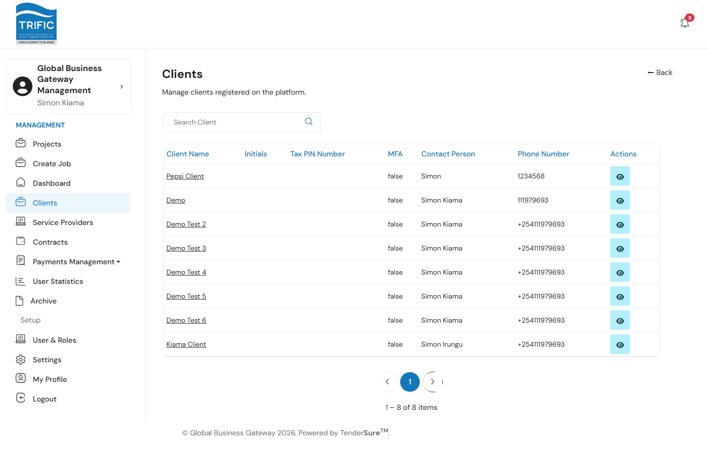
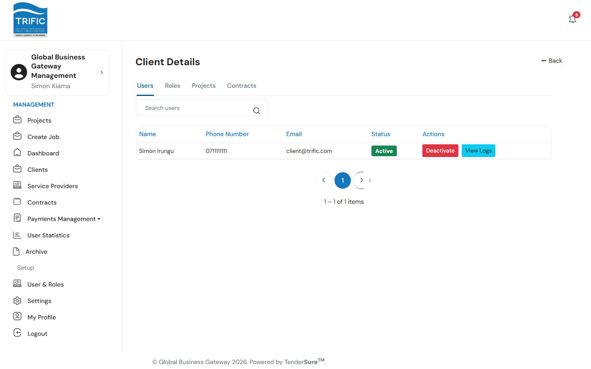
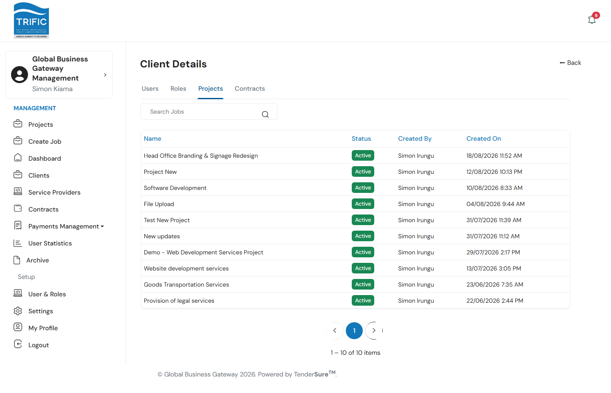
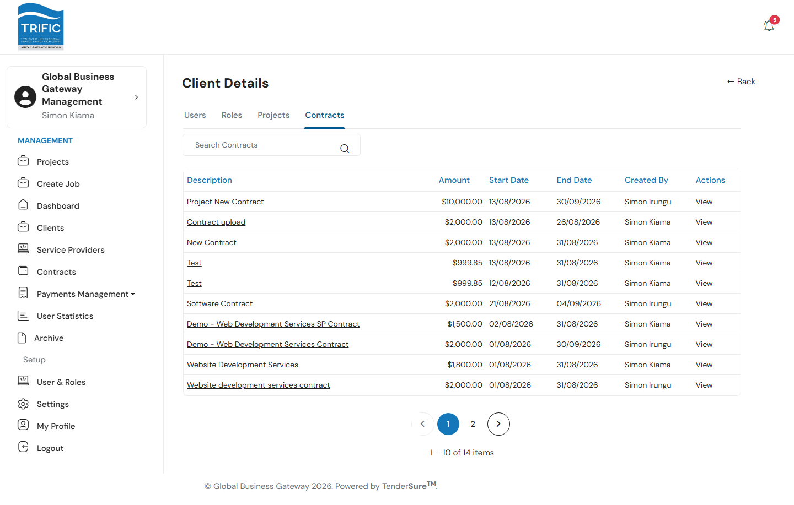
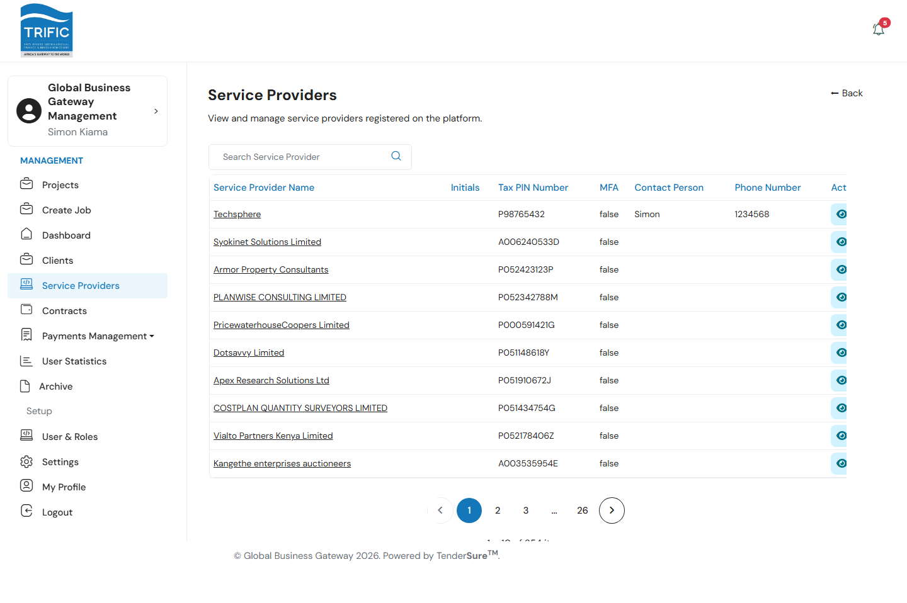
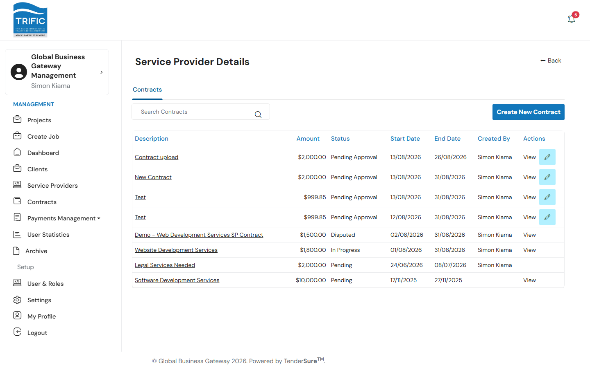

# Managing Clients and Service Providers

Management's role with Client and Service Provider companies is **account oversight** — viewing who's on the platform, managing their users' access, and (for Service Providers) blacklisting/messaging them. Note that vetting and prequalification review are **not** handled here: that work belongs entirely to the separate TenderSure Admin portal. Management never approves or rejects a Service Provider's vetting application.

## Clients

Open **Clients** from the left-hand menu to see every Client company registered on the platform, with columns for Client Name, Initials, Tax PIN Number, MFA status, Contact Person, and Phone Number.

Click a company name (or the eye icon) to open its detail page, which is organized into four tabs:

### Users tab

Every user account under that Client company, with Name, Phone Number, Username, and Status (Active/Inactive). Actions per user:

- **De-Activate / Reactivate** — opens a modal requiring a reason (reason is optional on reactivation). Deactivating locks that person out of the Client portal; the reason is logged for audit purposes.
- **View Logs** — opens a modal listing that user's deactivation/reactivation history: date, action, who performed it, and the reason given.

### Roles tab

The custom roles defined within that Client's own portal (Client companies can define their own internal roles/permissions, separate from Management's roles) — Name and Created On.

### Projects tab

Every project that Client company has created, with Title, Status, Created By, and Created On — a read-only view for context; use the [Projects](reviewing-projects-and-contracts.md) page to actually act on one.

### Contracts tab

Every contract belonging to that Client, with Description, Amount, Start/End Date, Created By, and a link to the contract file. Clicking a contract's description opens a **Contract Milestones** panel listing each milestone's Description, % Pay, Start/End Date, and Status.

## Service Providers

Open **Service Providers** from the left-hand menu for the equivalent list of every vetted Service Provider company — Name, Initials, Tax PIN Number, MFA, Contact Person, Phone Number.

Each row has three actions:

| Action | What it does |
|---|---|
| **View Details** (eye icon) | Opens the Service Provider's detail page. |
| **Send Message** (chat icon) | Opens a panel to send the provider a Subject + Message directly from Management — e.g. to flag a profile issue. |
| **Whitelist** | Only shown for a provider already flagged `blacklisted` — restores their standing. |

Blacklisting a provider (from a row that isn't already blacklisted) opens a panel requiring **Evidence** (a file upload) and a **Comment** explaining the reason, before it can be submitted.

### Service Provider detail page

The detail page has a **Contracts** tab listing every contract that provider holds — Description, Amount, Status, Start/End Date, Created By — plus a **Create New Contract** button (see [Reviewing & Approving Projects and Contracts](reviewing-projects-and-contracts.md#management-can-also-create-a-contract-directly) for the full field list). Clicking a contract opens its milestones, where Management reviews submitted work (**Approve** / **Reject**) via the milestone review modal.

## What's deliberately not here

Prequalification documents, vetting scores, and approval/rejection of a Service Provider's application are managed exclusively in the separate TenderSure Admin portal. Management's read-only view into a provider's submitted documents is limited to the [Document Archive](document-archive.md).
