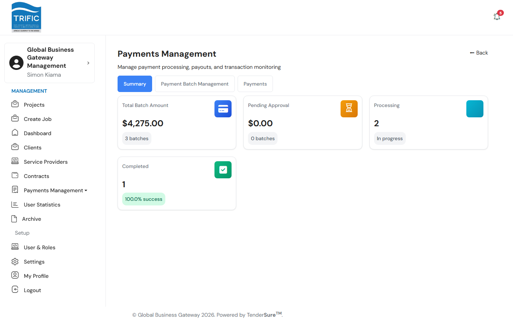
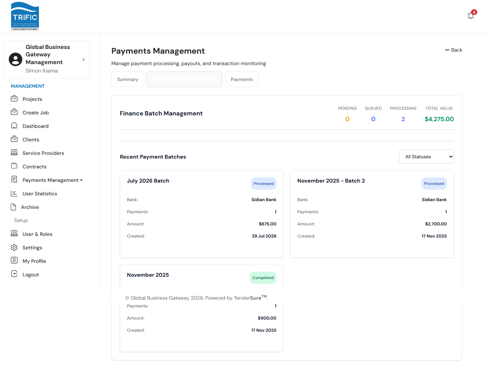
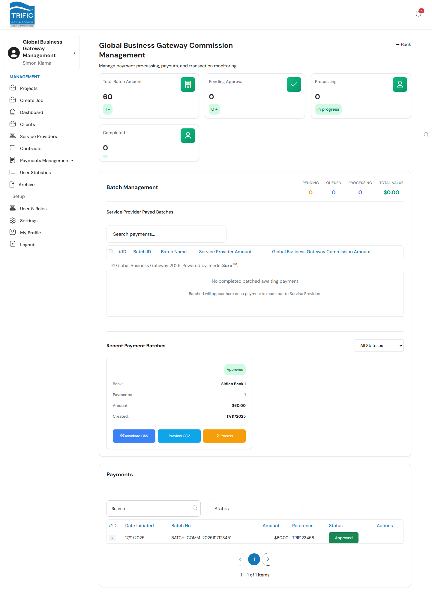
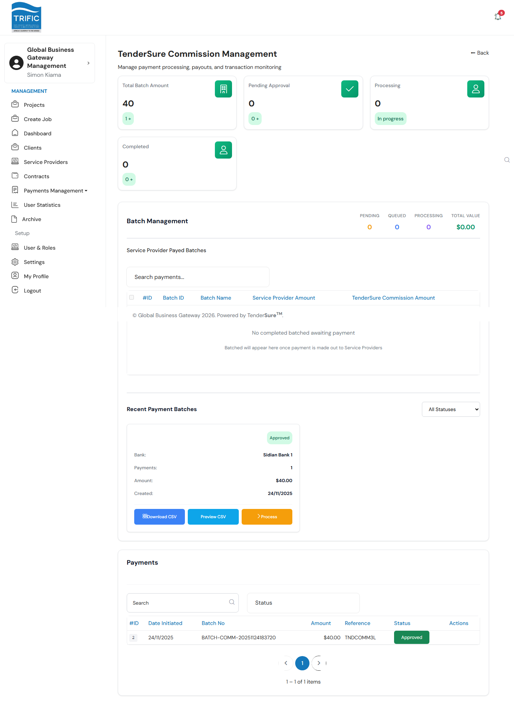

# Payments Management

**Payments Management** is a submenu with three sub-areas, all dealing with money leaving (or being tracked out of) the platform via bank payment batches:

- **Service Provider** (`/management/payments`) — paying Service Providers for approved work.
- **Global Business Gateway Commission** (`/management/trific-commission/payments`) — Trific's own cut of each payment.
- **TenderSure Commission** (`/management/tendersure-commission/payments`) — TenderSure's separate cut of each payment.

This is a distinctive part of the Management portal's job: it tracks and pays out commission for **two different parties** — Trific itself, and TenderSure Africa SEZ Limited (the SEZ operator Trific runs on top of) — as two entirely separate batch pipelines, alongside the actual money owed to Service Providers.

## Service Provider Payments

Open **Payments Management → Service Provider**. The page has three tabs.

### Summary tab

Four headline figures for the payment pipeline: **Total Batch Amount**, **Pending Approval**, **Processing**, and **Completed** (with a success-rate percentage).

### Payment Batch Management tab

This is where batches are built and moved through their lifecycle. It has two parts:

1. **Client-Approved Milestones Ready for Payment** — a table of every milestone the Client has already approved for payment, showing the milestone, its Contract/Client/Service Provider, Amount, approval date, and how many bank accounts are on file for that provider. Tick the checkboxes for the milestones you want to pay out together, then click **Create Batch (N selected)**, which opens a modal to name the batch, choose a **Payment Type** (EFT / PesaLink / RTGS), and add optional notes.
2. **Recent Payment Batches** — cards for each batch, showing its bank, payment count, amount, creation date, and status (Draft / Pending Approval / Approved / Processed / Completed / Failed). Depending on status, a card offers:
   - **Download CSV** / **Preview CSV** — export or preview the bank file (Sidian Bank format).
   - **Approve** — moves a `pending_approval` batch to `approved`.
   - **Process** — submits an `approved` batch to the bank for processing.

Clicking a batch card opens a detail drawer with the full batch information plus a **Commission Breakdown** panel — showing the split between Service Provider payout, Trific's revenue percentage, and TenderSure's fee percentage for that batch, both as figures and a visual bar.

### Payments tab

A flat, searchable list of every individual payment item across all batches — #ID, Date Initiated, Initiator, Beneficiary, Amount, Reference, and Status — filterable by **All / Processing / Paid**.

## Global Business Gateway (Trific) Commission

Open **Payments Management → Global Business Gateway Commission**. This tracks Trific's own commission earnings as a mirror of the Service Provider payments flow, but scoped to commission amounts rather than provider payouts:

- KPI cards for commission totals, pending approval, processing, and completed batches.
- A **Batch Management** section listing **Service Provider Paid Batches** — i.e. batches of provider payments that have already gone out, each carrying a Trific commission amount — which you select and group into a new **Commission Batch** the same way as provider payment batches (name, payment type, notes).
- A **Recent Payment Batches** grid with the same Approve / Process / Download CSV / Preview CSV actions.
- A flat **Payments** list of individual commission line items with their Batch No, Amount, Reference, and Status.

## TenderSure Commission

Open **Payments Management → TenderSure Commission**. This page is structurally identical to the Global Business Gateway Commission page above — same KPI cards, same Batch Management/milestone-selection workflow, same Recent Payment Batches grid and Payments list — but it tracks **TenderSure Africa SEZ Limited's** separate commission share instead of Trific's. The backend keeps these as two independent ViewSets (`TrificCommissionViewSet` and `TenderSureCommissionViewSet`), so approving or processing a batch on one page has no effect on the other.

## How the three pipelines relate

Every payment batch carries all three splits from the moment it's created from approved milestones: the **Service Provider's** payout amount, **Trific's** commission percentage, and **TenderSure's** commission percentage (visible in the batch detail drawer's Commission Breakdown). The three "Payments Management" sub-pages are really three different lenses on the same underlying batches — filtered and totalled by who ultimately receives the money.
