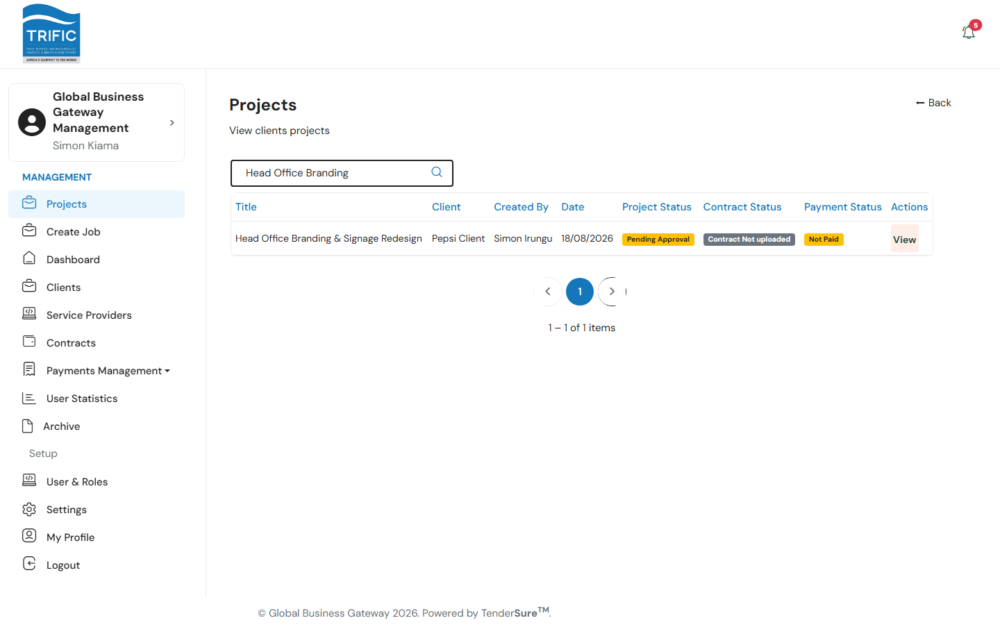
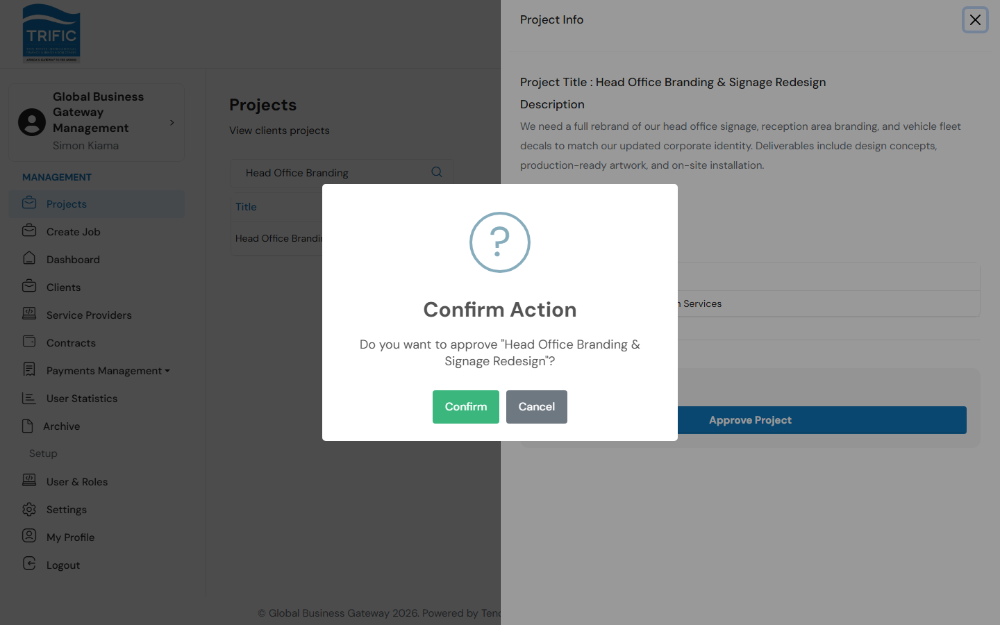
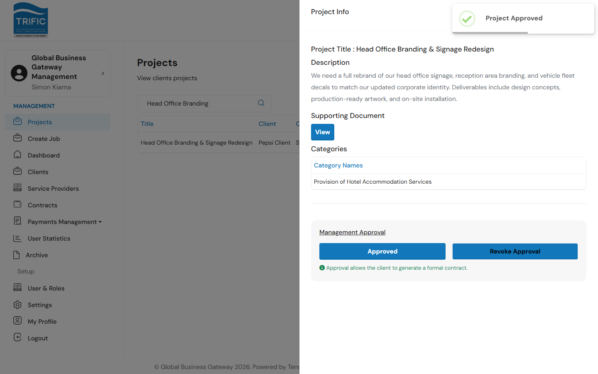
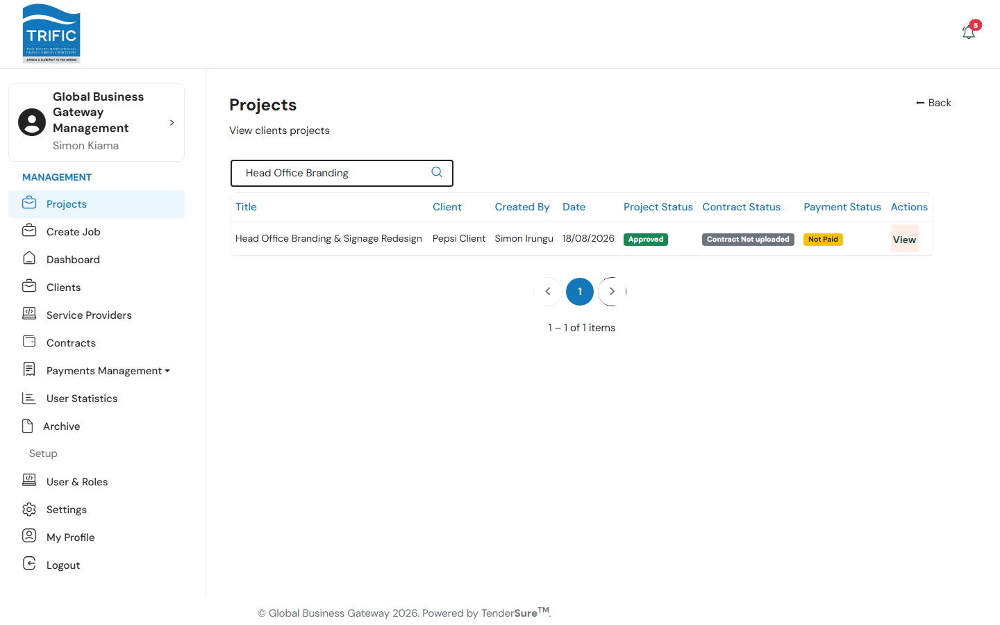
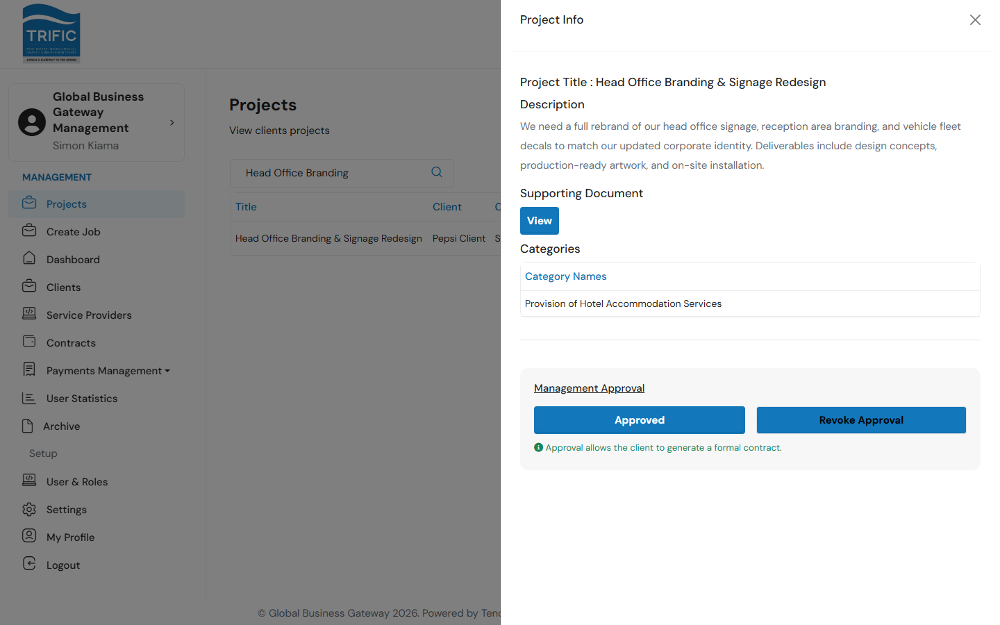
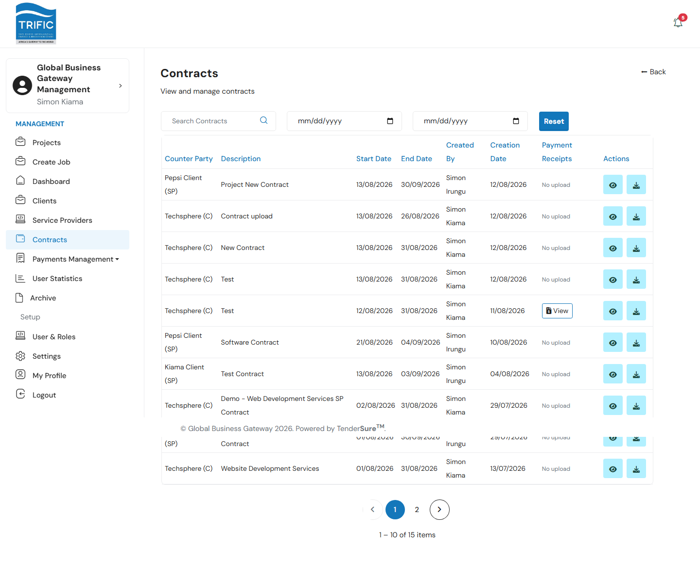
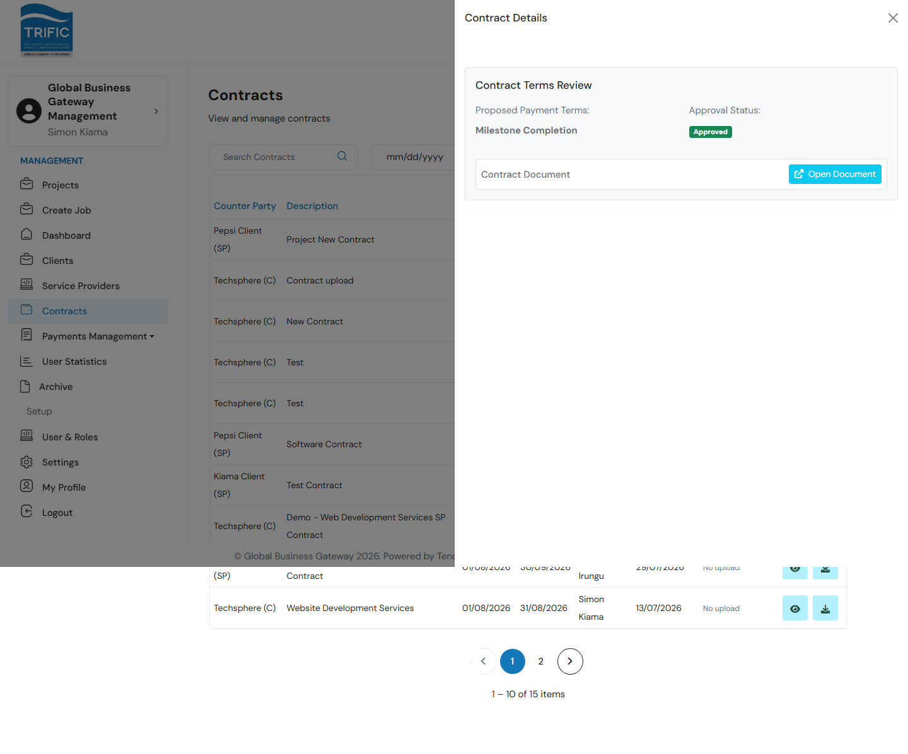

# Reviewing & Approving Projects and Contracts

This is the core gatekeeping job the Management portal exists to do. Every piece of paid work on Trific follows the same pipeline:

**Client creates a Project → Management approves the Project → a Contract is created against it → Management approves the Contract → the Client pays.**

Management sits at both approval gates. Nothing a Client submits becomes billable work until Management has signed off on it here. This guide walks through both gates using a real example: a project called **"Head Office Branding & Signage Redesign"**, created by the Client company "Pepsi Client".

## Part 1 — Approving a Project

### 1. Find the pending project

Open **Projects** from the left-hand menu. This page lists every project created by every Client company on the platform, with columns for Title, Client, Created By, Date, **Project Status**, **Contract Status**, and **Payment Status**.

Use the search box (top-left) to narrow the list — it searches project title, description, and client company name.

### 2. Review the project

Click **View** on the row. A side panel opens showing everything Management needs to make a decision:

- **Project Title** and **Description** — what the Client is asking for.
- **Supporting Document** — a link to the file the Client attached (scope of work, drawings, etc.).
- **Categories** — the service categories the project falls under, which determine which vetted service providers will later be eligible.

At the bottom of the panel is a **Management Approval** box with an **Approve Project** button. Until you act, the project's status stays `Pending Approval`.

### 3. Approve (or revoke) the project

Click **Approve Project**. A confirmation dialog appears asking you to confirm the action.

Confirm, and the project is marked approved — you'll see a success notification, and the platform emails the Client to let them know the project can now move forward.

Back on the Projects list, the **Project Status** badge for that row now reads **Approved**:

If you open the project again, the panel now shows **Approved** on the button (disabled) and a **Revoke Approval** button appears next to it — this is only available while the project has no contract yet. Revoking flips the project back to `Pending Approval` and notifies the Client.

> **What approval unlocks:** Approving a project doesn't do anything to a Contract by itself — it simply allows the Client to generate a formal Contract against that project (or, per the note below, allows Management to create one). Until it's approved, the project cannot move into the contract stage at all.

## Part 2 — Reviewing & Approving a Contract

Once a project is approved, a Contract is created against it — either by the Client (through their own portal) or by Management. A Contract captures the binding commercial terms: the linked job, a description, the **Amount**, **Start/End dates**, a signed contract file, and one or more **Milestones** (each with its own description, amount, and end date).

### 1. Open Contracts

Open **Contracts** from the left-hand menu. This lists every contract on the platform — both Client-side contracts (created against a project) and direct Management-created contracts with a Service Provider — with the **Counter Party**, Description, Start/End Date, Created By, Creation Date, any uploaded **Payment Receipt/Proof**, and Actions.

Use the search box and the two date filters (From/To, filtered on creation date) to narrow the list, then **Reset** to clear them.

### 2. Review contract terms

Click the eye icon (**View Details**) on a row. A panel opens showing:

| Field | What it means |
|---|---|
| **Proposed Payment Terms** | The payment structure the Client proposed (e.g. "Milestone Completion"). |
| **Approval Status** | `Approved` or `Awaiting Management`. |
| **Contract Document** | Link to open the uploaded contract file. |

### 3. Approve or dispute

If the contract hasn't been approved yet, two buttons appear:

- **Approve Terms** — accepts the contract as-is. This sets `management_payment_terms_approved` on the contract, marks the linked project's `contract_approved` flag, and emails the Client that their contract is approved and ready for payment.
- **Dispute Terms…** — opens a text box requiring a reason. Submitting it (**Confirm Dispute & Send**) resets both the Management and Client approval flags, marks the contract status as `dispute`, and emails the Client with your notes so they can revise and resubmit.

Once approved, the project's **Contract Status** column back on the Projects list flips from `Contract Not uploaded` (or `Pending Approval`) to **Approved**, and the Client can proceed to make payment — the **Payment Status** column then updates once they do.

## Management can also create a Contract directly

Besides reviewing Client-submitted contracts, Management can originate a Contract itself — useful when pairing a specific Service Provider to a Client's job. From **Contracts**, click **+ Create New Provider Contract** (or, from a Service Provider's own detail page, **Create New Contract** on their Contracts tab) and fill in:

| Field | Notes |
|---|---|
| **Service Provider** / **Client** | Select both counterparties. |
| **Associated Job** | Required — the job this contract is for; the dropdown is filtered to the selected client's jobs. |
| **Description**, **Start Date**, **End Date** | Contract terms. |
| **Total Payout Amount** | The overall contract value. |
| **Contract File (PDF)** | Required upload. |
| **Milestones** | One or more, each with a Description, Amount, and End Date. The sum of milestone amounts must equal the contract's Total Payout Amount, or submission is blocked client-side. |

Submitting creates the contract immediately (it does not require a separate approval step in this flow, since Management originated it).

## Milestone verification

Once a contract is underway, work is delivered against its milestones. From a Service Provider's detail page → **Contracts** tab, clicking a contract opens its **Contract Milestones** panel. Milestones sitting in `review` status (the Service Provider has submitted their work) show a **View** action that opens a review modal where Management can:

- Download the **Milestone Report** the Service Provider uploaded.
- **Approve** — moves the milestone to `approval`, notifying the Client to give final sign-off and release payment.
- **Reject** — sends the milestone back to `In Progress` and notifies the Service Provider to redo the work.

This is the mechanism that eventually produces the "Client-Approved Milestones Ready for Payment" queue you'll see in [Payments Management](payments-and-commissions.md).
