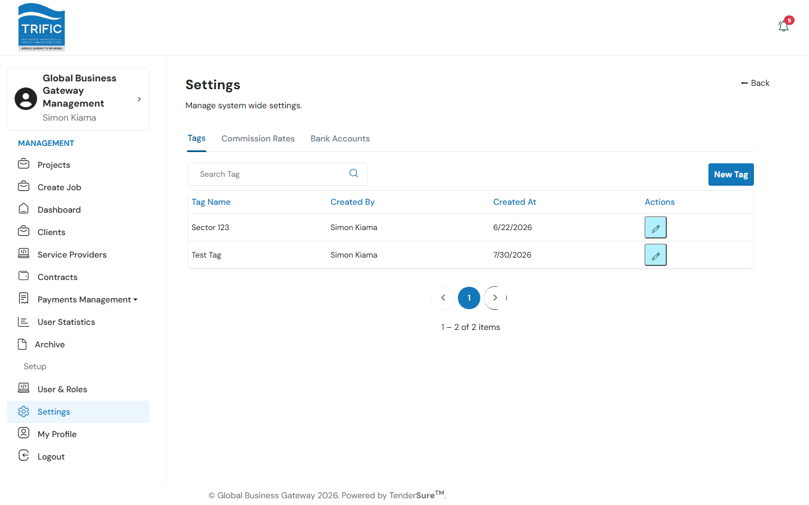
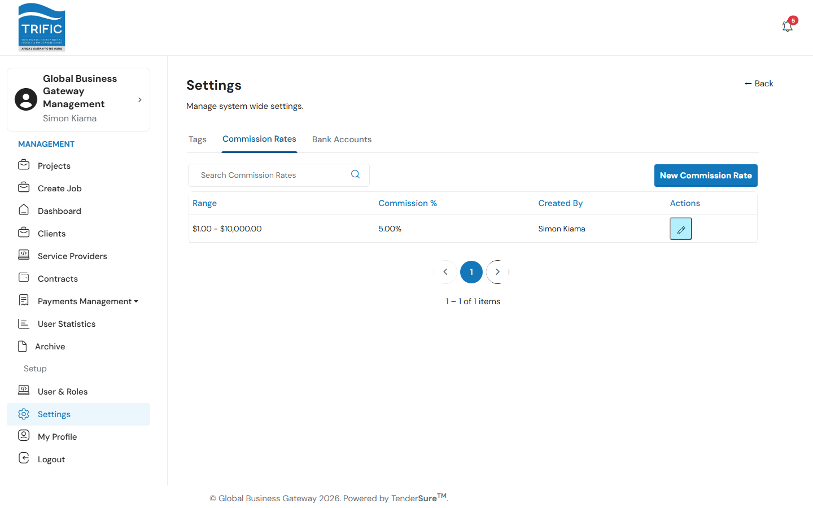
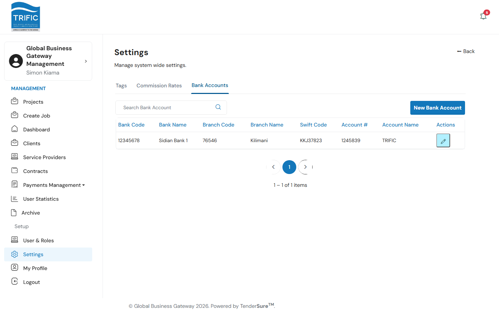
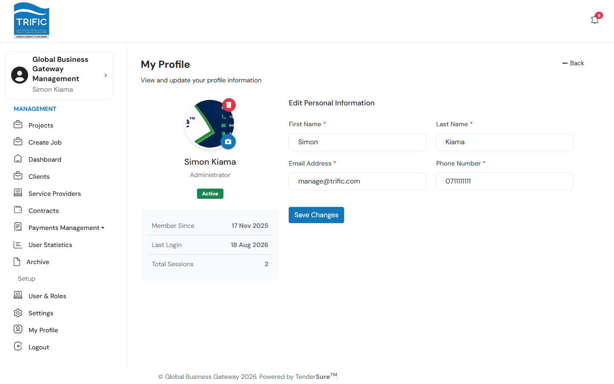

# Settings

**Settings** holds the platform-wide configuration values that everything else in the Management portal (and, indirectly, the Client and Service Provider portals) relies on. Open **Settings** from the left-hand menu (`/management/settings`); it's organized into three tabs.

## Tags

Reusable metadata tags that Clients attach to Projects and Management attaches to Jobs (e.g. "Budget", "Duration", "English Level"; see [Creating a Project](../client/creating-a-project.md) for how Clients use these). **New Tag** creates one; the pencil icon edits an existing tag's name.

## Commission Rates

Tiered commission rates applied by contract value range. Each row defines a **Range Start**, **Range End**, and **Commission %**, plus who created it. **New Commission Rate** adds a tier; the pencil icon edits an existing one.

> These are the platform's baseline commission tiers, distinct from the per-batch Trific/TenderSure commission splits you review in [Payments Management](payments-and-commissions.md). Treat this tab as sensitive configuration: avoid changing live rates outside a deliberate, approved change.

## Bank Accounts

The bank accounts Trific/TenderSure use to disburse payment batches (Sidian Bank, per the payment batch CSV/Excel format referenced elsewhere in the portal). Each entry records Bank Code, Bank Name, Branch Code, Branch Name, SWIFT Code, Account Number, and Account Name. **New Bank Account** adds one; the pencil icon edits an existing entry.

## My Profile

Every Management staff member manages their own account details at **My Profile** (`/management/user-profile`), separate from Settings. It shows your role, join date, last login, and session count, and lets you:

- Upload, change, or delete your profile picture (1MB limit).
- Edit your **First Name**, **Last Name**, **Email**, and **Phone Number**, then **Save Changes**.

