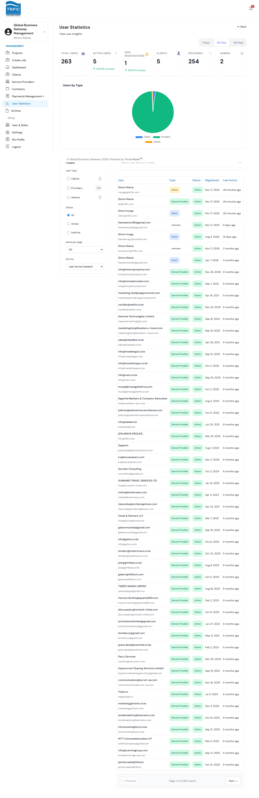

# User Statistics

**User Statistics** is Management's dashboard for understanding who is using the platform: growth, mix of account types, and individual account activity, separate from the financial figures shown on the main [Dashboard](dashboard.md).

## Opening User Statistics

Open **User Statistics** from the left-hand menu (`/management/user-insight`).

### Statistics summary

At the top, a row of cards shows:

| Card | What it shows |
|---|---|
| **Total Users** | All accounts on the platform (Clients + Service Providers + Management/Admin users). |
| **Active Users** | Accounts currently active. |
| **New Registrations** | New sign-ups in the selected period, with a percentage-change indicator. |
| **Clients** | Count of Client accounts. |
| **Providers** | Count of Service Provider accounts. |
| **Admins** | Count of internal admin accounts. |

A **Users by Type** pie chart visualizes the Client/Provider/Admin split. You can switch the reporting window between **7 Days**, **30 Days**, and **90 Days** using the buttons in the top-right of the statistics panel.

### Filters and search

The left sidebar lets you narrow the user table by:

- **User Type**: Clients / Providers / Admins (with live counts next to each).
- **Status**: Active / Inactive.
- **Items per page** and **Sort by** (e.g. Last Active).

A search box above the table filters by name or email. An active-filters badge shows how many filters are currently applied, with a **Clear** option.

### The user table

Lists every matching user with Type, Status, Registered date, and Last Active, paginated. Clicking a row opens a detail drawer showing that user's full profile plus their recent visit/session history, useful for investigating account activity without leaving the page.

## Financial reporting

Platform-wide financial figures (Total Revenue, Escrow Balance, Active Jobs, Contract counts, and the Revenue Trend chart) live on the main **Dashboard** rather than a separate financial-reports page; see [Dashboard](dashboard.md) for that view. Commission-specific financial breakdowns (Trific's and TenderSure's cut of each payment batch) are shown per-batch in [Payments Management](payments-and-commissions.md).
