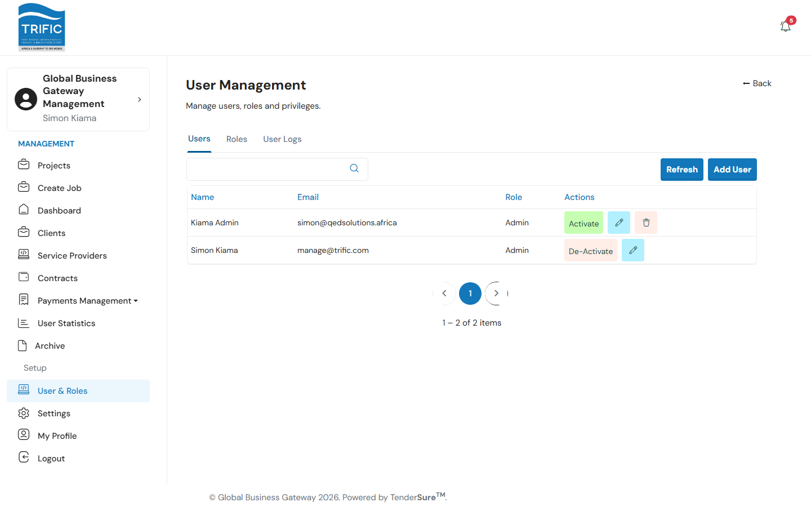
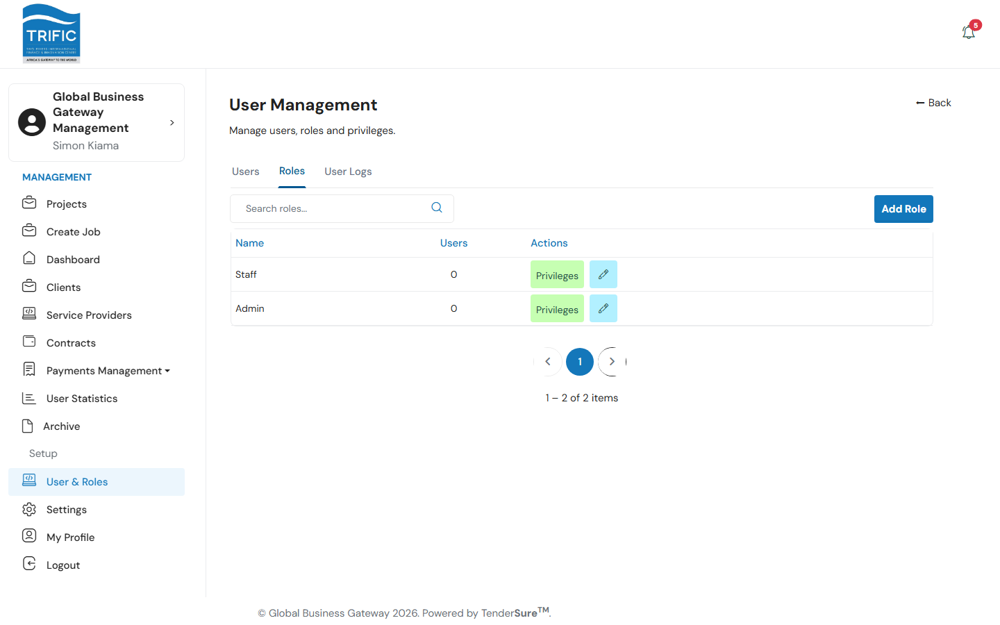
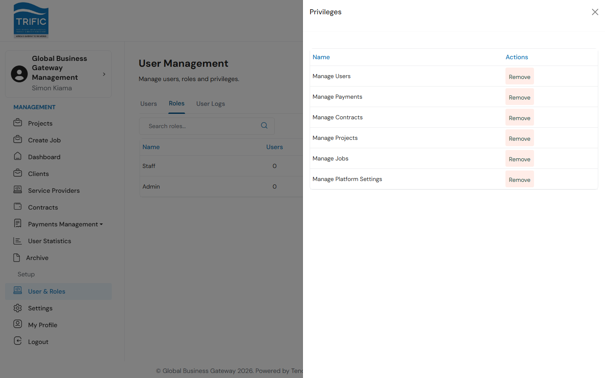
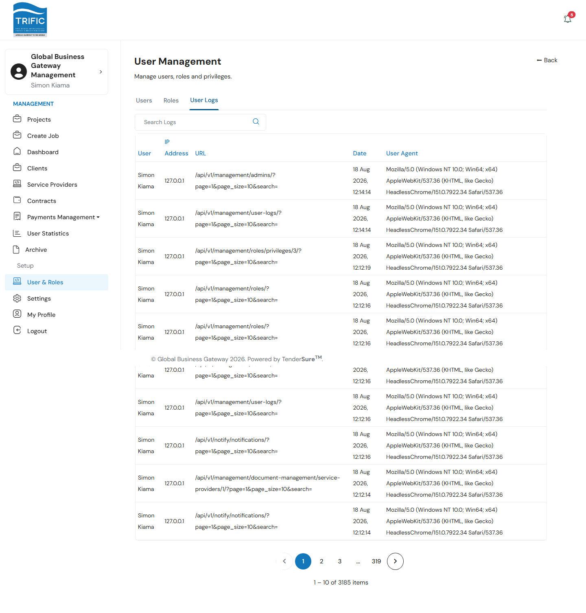

# User & Roles

**User & Roles** is where Management administers *its own* internal staff: the people who log into this Management portal itself (not Client or Service Provider accounts, which are handled under [Managing Clients and Service Providers](managing-clients-and-providers.md)). It covers who has an account, what role each person holds, and exactly which actions each role is allowed to perform.

Open **User & Roles** from the left-hand menu (`/management/user-management`). The page has three tabs: **Users**, **Roles**, and **User Logs**.

## Users tab

Lists every Management staff account: Name, Email, Role, and Actions.

- **Add User** opens a panel to create a new Management account: **First Name**, **Last Name**, **Email**, and **Role** (picked from the roles configured on the Roles tab).
- The pencil icon opens the same panel pre-filled, to edit an existing user's details or reassign their role.
- **De-Activate / Activate** toggles the account's ability to log in.
- **Refresh** re-fetches the list.

## Roles tab

Lists every role defined for the Management portal (e.g. **Admin**, **Staff**), with a count of how many users hold each one.

- **Add Role** creates a new role (just a **Name**; permissions are attached afterward via Privileges).
- The pencil icon renames an existing role.
- **Privileges** opens a panel listing every permission that can be toggled for that role, with **Assign**/**Remove** actions per permission. The permissions that actually exist and gate the Management sidebar are:

  | Privilege | Unlocks |
  |---|---|
  | Manage Projects | The **Projects** nav item |
  | Manage Jobs | The **Create Job** nav item |
  | Manage Contracts | The **Contracts** nav item |
  | Manage Payments | The **Payments Management** submenu |
  | Manage Users | **User Statistics** and **User & Roles** |
  | Manage Platform Settings | **Settings** and **My Profile** |

  

  Removing a privilege from a role immediately hides the corresponding nav item for every staff member holding that role. This is a real access-control mechanism, not just a display setting.

## User Logs tab

An audit trail of Management staff activity (User, IP Address, URL accessed, Date, and User Agent), searchable, for security/audit review of who did what in the portal.

