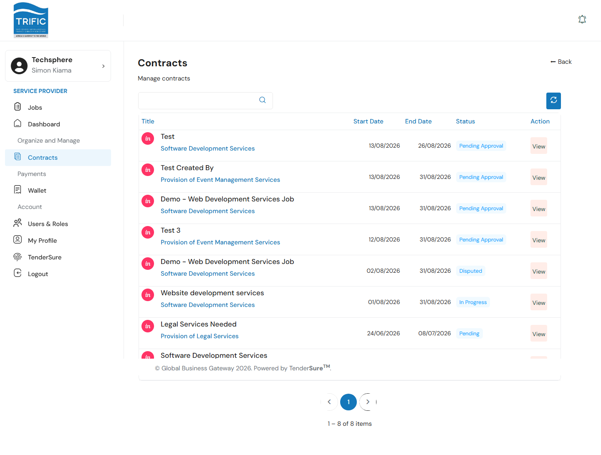
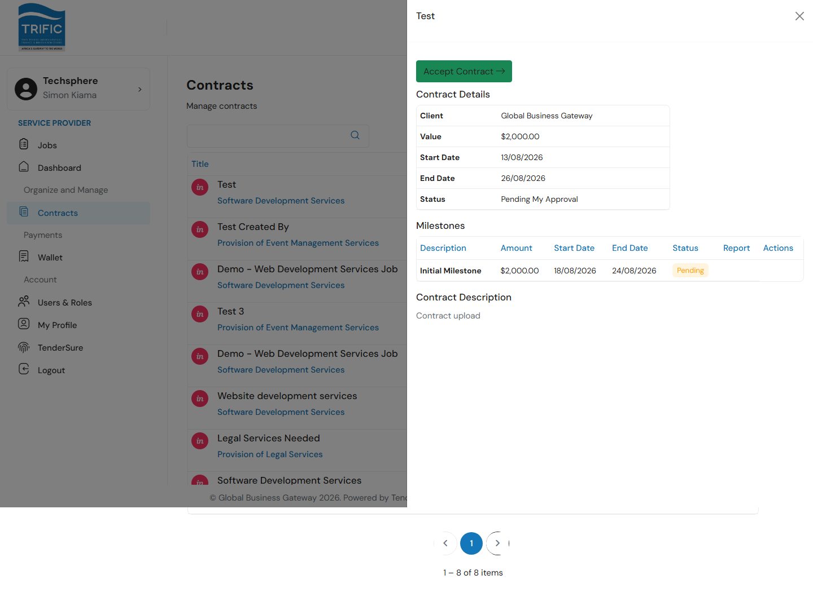
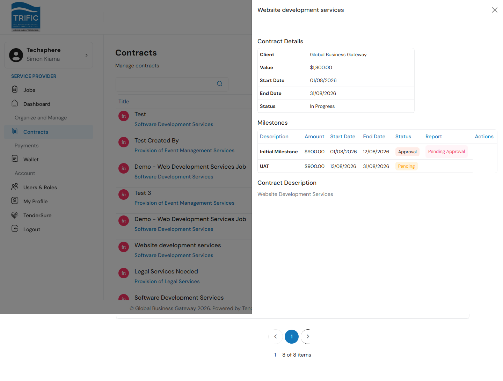

# Contracts & Milestones

Once a proposal succeeds, the work is formalized as a **Contract**, broken into **milestones**. Open the list from the left-hand menu: **Contracts**.

## 1. Contracts list

Every contract your company is party to is listed with its title, associated job category, start/end dates, and status.

Click **View** on any row to open its full detail panel.

## 2. Accepting a new contract

A newly-created contract starts out waiting on you. If you haven't accepted it yet, the panel shows an **Accept Contract** button above the contract details, and the **Status** row reads "Pending My Approval".

The **Contract Details** table shows the client, contract **Value**, **Start Date**, **End Date**, and status. Click **Accept Contract** (with a confirmation prompt) to formally accept. This is what unlocks the ability to submit milestone work.

## 3. Milestones

Below the contract details, the **Milestones** table lists each milestone with its description, amount, start/end dates, and status (e.g. `Pending`, `In Progress`, `Approval`).

Once you've accepted the contract, a milestone that's **In Progress** shows a **Submit** button in its row. Clicking it opens a dialog asking you to upload a PDF report of the completed work: that upload is required to submit. After submission, the milestone moves into review, and a **View Report** link appears in the milestone row. From here, approval happens in two steps you won't see directly: **Management reviews your submitted report first**, and only once they approve it does it move on to the **Client** for their own final sign-off. If Management sends it back instead, the milestone returns to **In Progress** so you can redo the work.

## What you can't do here

- You can't submit a milestone before accepting the contract, or before its status is `In Progress`.
- There is no way from this portal to unilaterally end a contract early: contract completion is driven by the milestones reaching approval, not a manual "End Contract" action from the provider side.

## Where contract payments show up

Once a milestone's report is approved, its payment flows through escrow into your wallet. See [Payments & Wallet](payments-and-wallet.md) for how to track amounts owed, in escrow, and paid out.
