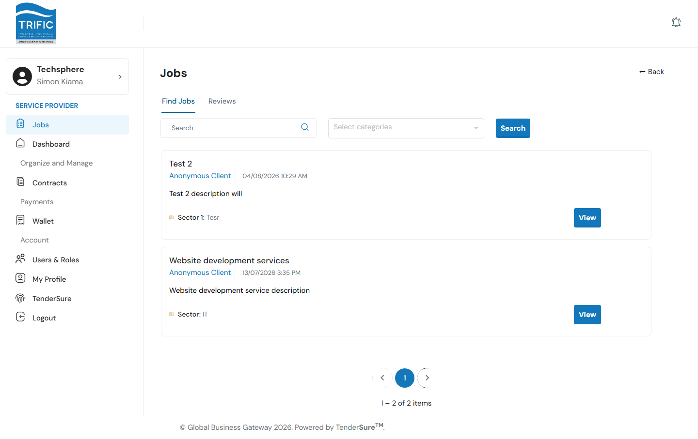
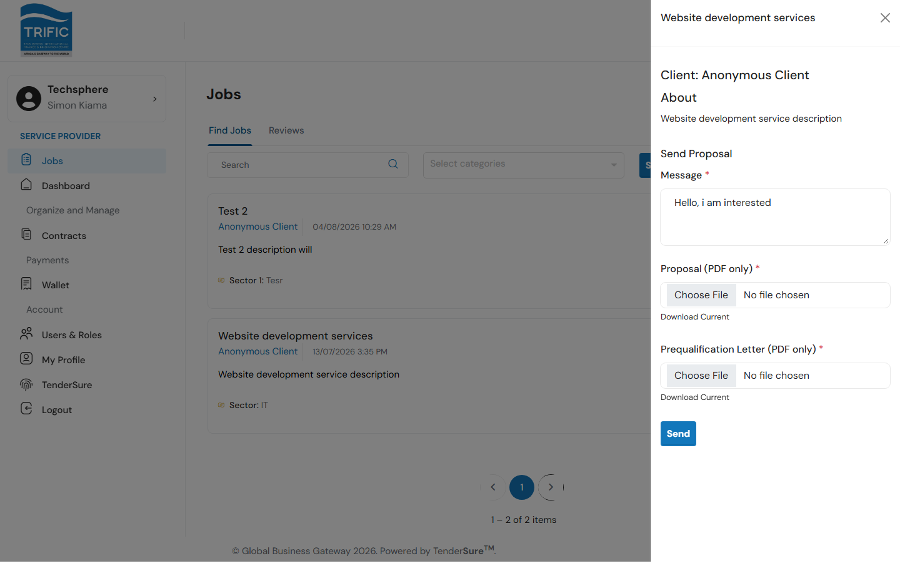
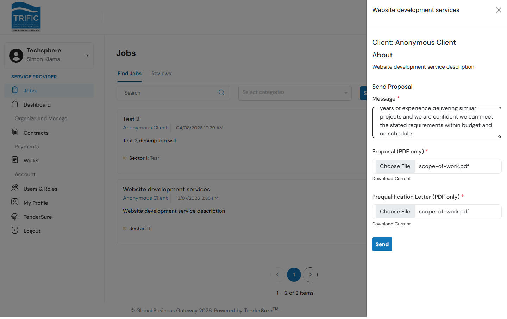
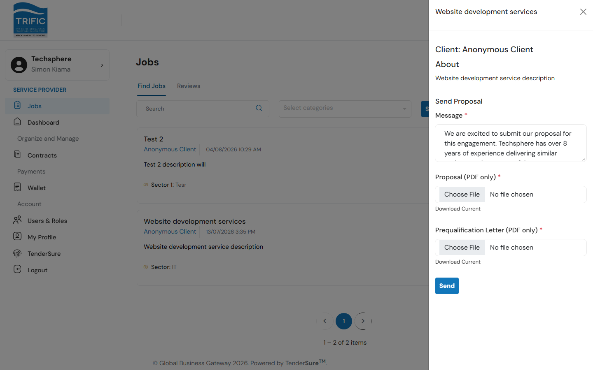
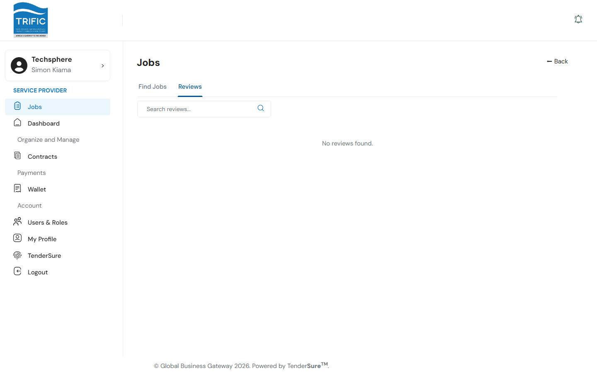

# Finding & Applying to Jobs

The **Jobs** page is where you browse open work on the marketplace and send proposals for it. Open it from the left-hand menu: **Jobs**.

> **Note on "Invited Jobs":** the codebase includes components for a separate "job invites" flow (jobs a client invites your company to directly, as opposed to open marketplace jobs), but as currently built, the Jobs page only exposes two tabs: **Find Jobs** and **Reviews**. If invitations are enabled in a future release, they will likely appear as an additional tab here.

## 1. Find Jobs

The **Find Jobs** tab lists every open job on the marketplace that your company is eligible to apply to.

- **Search**: free-text search, press Enter or click **Search**.
- **Select categories**: a multi-select, searchable category tree; filtering narrows the list to jobs tagged with the categories you pick.
- Each job card shows the title, client, when it was posted, a description, and any tags the client attached (e.g. budget/sector information).

Click **View** on a job to open its details.

## 2. Job details and sending a proposal

The job panel shows the client name and the full job description. Below that is the **Send Proposal** form:

| Field | Notes |
|---|---|
| **Message** | Your proposal message to the client. Required, minimum 2 characters. |
| **Proposal (PDF only)** | Your proposal document. Required, PDF only, max 5MB. |
| **Prequalification Letter (PDF only)** | A supporting PDF the job listing asks for. Required, PDF only, max 5MB. |

Only vetted providers (vetting status other than `Pending`) can send a proposal. If your account is still in initial vetting, the panel shows a message telling you your profile is still under review instead of the form.

Fill in the message and attach both PDFs:

Click **Send**. On success, a confirmation dialog explains what happens next:

1. Global Business Gateway's management team will review your proposal.
2. You will be contacted via email if you are shortlisted.

There is no separate "applied" status shown on the job card afterwards, and reopening a job you've already applied to currently re-shows the same Send Proposal form, pre-filled with the message you last submitted (this lets you review or revise your wording). It isn't a sign your original submission was lost.

## 3. Reviews

The **Reviews** tab shows ratings and written reviews clients have left for your company after completed work, with a **Respond** action against each one.

If your company has no reviews yet, this tab simply shows "No reviews found."
