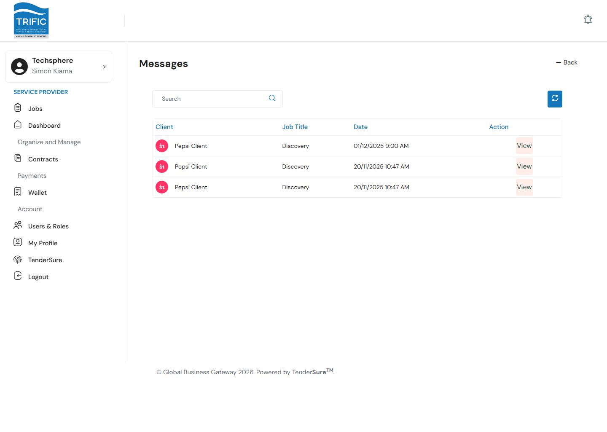
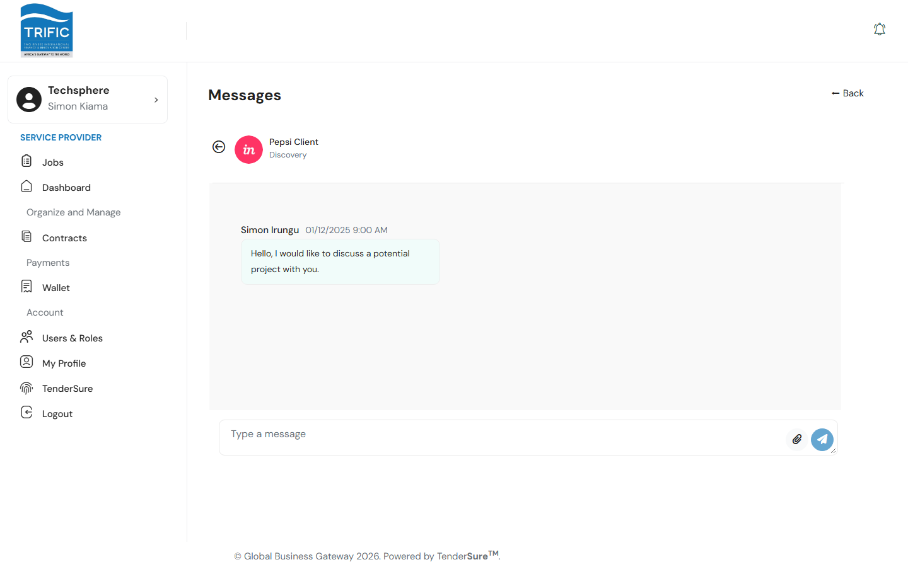
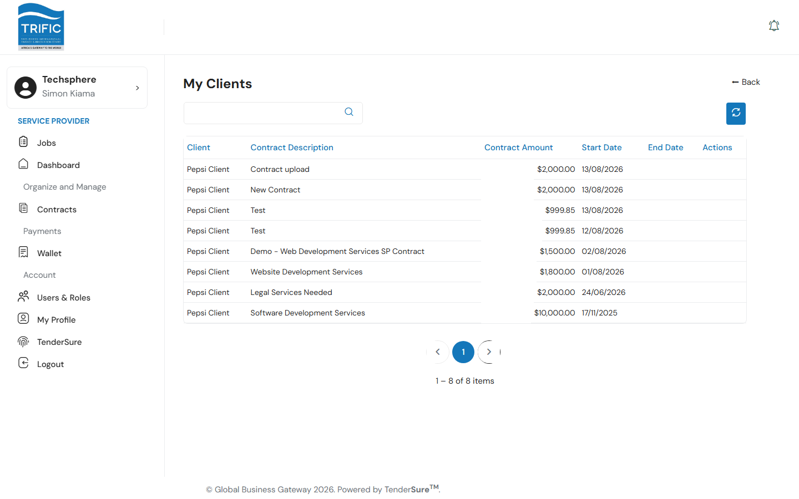

# Messaging & Past Clients

Two smaller but useful pages round out the portal: a unified **Messages** inbox, and a **My Clients** list of everyone you've contracted with. Neither is currently linked from the left-hand sidebar — reach them directly at `/service-provider/messages` and `/service-provider/my-clients`, or via links surfaced elsewhere in the app (for example, the **Messages** tab inside a job's detail panel uses the same underlying inbox).

## Messages

The inbox lists every conversation thread you're part of — one row per client/job combination, showing who it's with, the related job title, and the date of the last message.

Click **View** on a thread to open the conversation. You can read the full message history and reply with text and/or file attachments (the paperclip icon lets you attach one or more files before sending).

Use the back arrow next to the client's name to return to the inbox list.

## My Clients

**My Clients** is a simple record of every contract you've had with a client, regardless of status — client name, contract description, contract amount, start date, and end date.

There isn't a detail view or action from this page — it's a quick reference for your contracting history with each client, useful for recalling past engagements when a client reaches out again or when compiling a track record for a new proposal.
