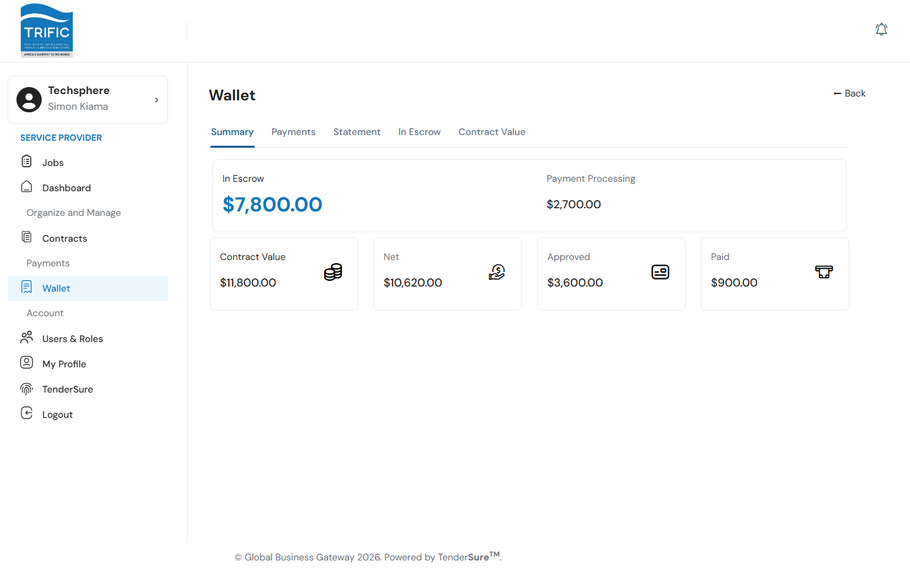
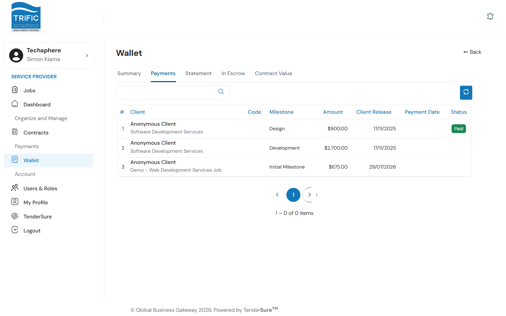
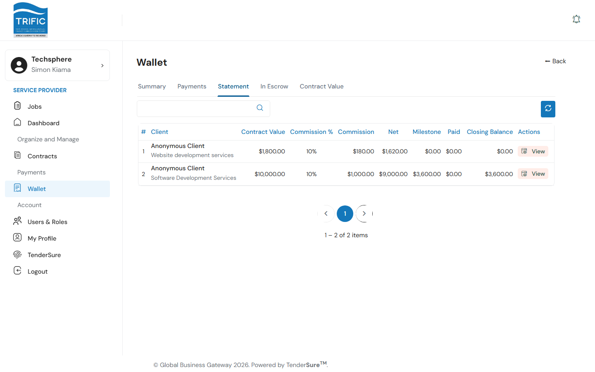
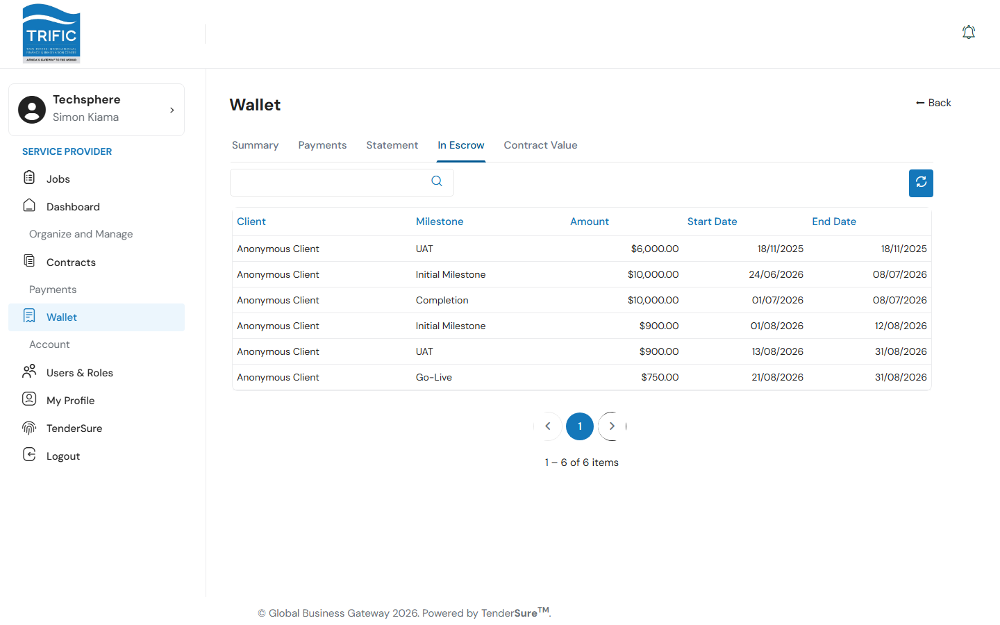
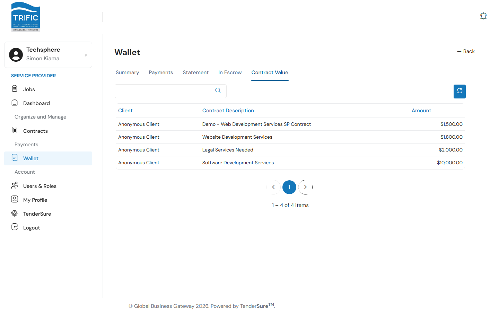

# Payments & Wallet

The **Wallet** page is where you track what you're owed, what's already been paid out, and the overall value of your contracts. Open it from the left-hand menu: **Wallet**. It has five tabs.

## 1. Summary

The default tab gives you the headline numbers at a glance.

- **In Escrow**: funds a client has paid in that are being held against your active milestones, not yet released to you.
- **Payment Processing**: payments that have been initiated but haven't completed yet.
- **Contract Value**, **Net**, **Approved**, **Paid**: the total value of your contracts, the net (after commission), the amount from approved milestones, and what's actually been paid out so far.

Clicking the **In Escrow** or **Contract Value** tiles jumps you straight to those tabs.

## 2. Payments

A running list of individual milestone payments: client, job, payment code, milestone name, amount, the date the client released funds, the date you were paid, and status (`Paid`, `Processing`, `Failed`, or `Pending`/"In Progress").

## 3. Statement

A per-contract breakdown showing contract value, Trific's commission percentage and amount, your net, how much has hit milestone payouts, how much has been withdrawn, and the closing balance.

Click **View** on a row to see that contract's milestone-by-milestone gross/commission/net figures, plus a running ledger of opening/closing balances by date.

## 4. In Escrow

Every milestone currently sitting in escrow (paid by the client, not yet released to you), with client, milestone name, amount, and its start/end dates.

## 5. Contract Value

A simple list of every contract's client, description, and total amount, useful for a quick total of your book of business.

## How payouts actually happen

Money moves through a fixed pipeline: a client pays into escrow for a contract → you deliver and submit a milestone (see [Contracts & Milestones](contracts-and-milestones.md)) → once approved, Trific deducts its commission and the net amount moves from "In Escrow" toward "Paid." There's no self-service payout/withdrawal action currently reachable from the Wallet UI in this build. Payouts happen automatically as milestones clear, and you track their progress across these five tabs rather than triggering them yourself.
