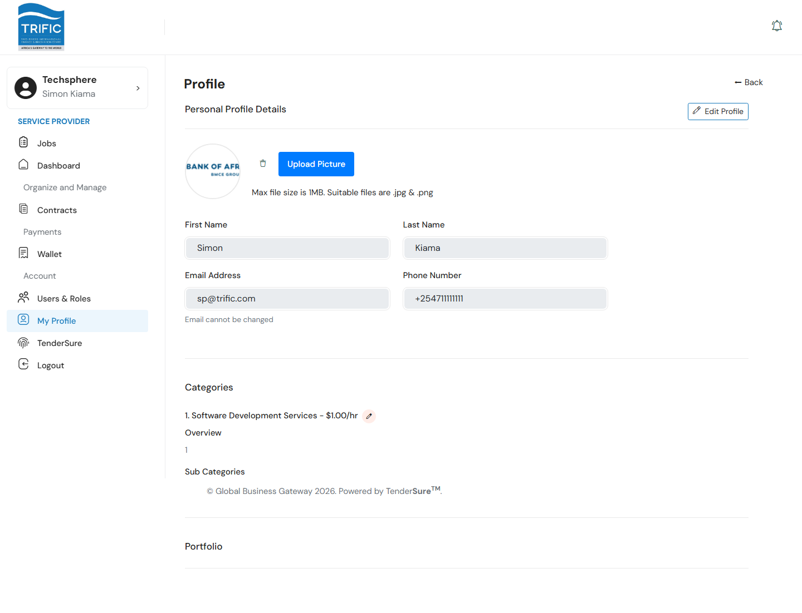
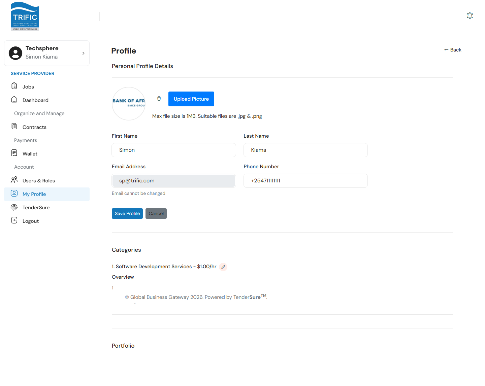
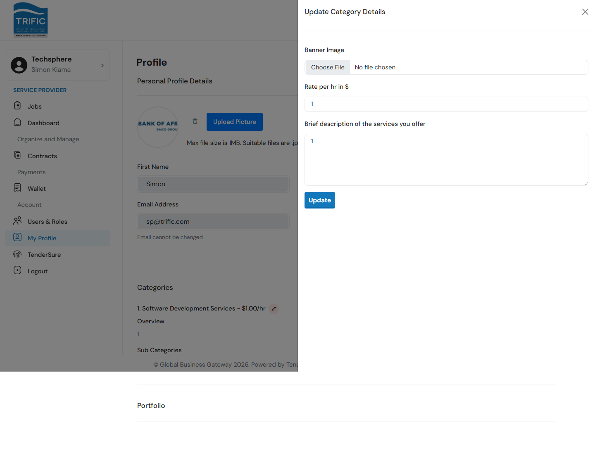

# Profile & Portfolio

Your profile is what Global Business Gateway and prospective clients see about your company: your personal contact details, the service categories you're qualified to work in, and a portfolio of past work you can show off. Open it from the left-hand menu under **Account → My Profile**.

## 1. Personal Profile Details

The top of the page shows your photo and personal details.

- **Profile Picture**: click **Upload Picture** to set an avatar (JPG or PNG only, max 1MB). If one is already set, a delete icon appears next to **Upload Picture** to remove it.
- Click **Edit Profile** to unlock the **First Name**, **Last Name**, and **Phone Number** fields. **Email Address** is always disabled: it cannot be changed from this page.

Click **Save Profile** to submit, or **Cancel** to discard changes. First and last name are required.

## 2. Service Categories

Below your personal details, **Categories** lists every service category your company is registered to offer, each with its hourly rate, an overview description, and (for Legal categories) its sub-categories.

Click the pencil icon next to a category to open **Update Category Details**, where you can update:

| Field | Notes |
|---|---|
| **Banner Image** | An image shown against this category on your profile. |
| **Rate per hr in $** | Required, must be greater than 0. |
| **Brief description of the services you offer** | Required. |

Click **Update** to save. Note that this page only lets you edit the *rate and description* of categories you already offer. Adding a brand-new category to your company happens through vetting on TenderSure (see [Vetting & Onboarding Status](vetting-and-onboarding-status.md)), not here.

## 3. Portfolio

**Portfolio** shows past-work samples grouped under each service category, each with a title, client name, date range, and cover image.

**Add Portfolio** only appears while your account's vetting status is `Pending` or `Approved`, i.e. before your vetting is fully finalized. Once vetting reaches `Success` (fully vetted), the link disappears and this section becomes read-only from this page.

When available, clicking **Add Portfolio** opens a form with these fields:

| Field | Notes |
|---|---|
| **Category** | Which of your service categories this piece of work belongs to. Required. |
| **Title** | Required, at least 2 characters. |
| **Client Name** | Required, at least 2 characters. |
| **Period of Work** | Start and end date, both required. |
| **Description** | Required, 50–1000 characters. |
| **Main Image** | Cover image for the portfolio item. |
| **Other Attachments** | Supporting files: PNG, JPG, JPEG, or PDF. |

While still `Pending` or `Approved`, clicking an existing portfolio item's title opens a detail view with **Edit** and **Delete** icons so you can keep entries current before vetting is finalized.

## Where this data is used

Your categories, rates, and portfolio are what Global Business Gateway and clients see when deciding whether to invite or shortlist you for work, so keep the descriptions and past-work samples accurate and up to date while you still have edit access.
