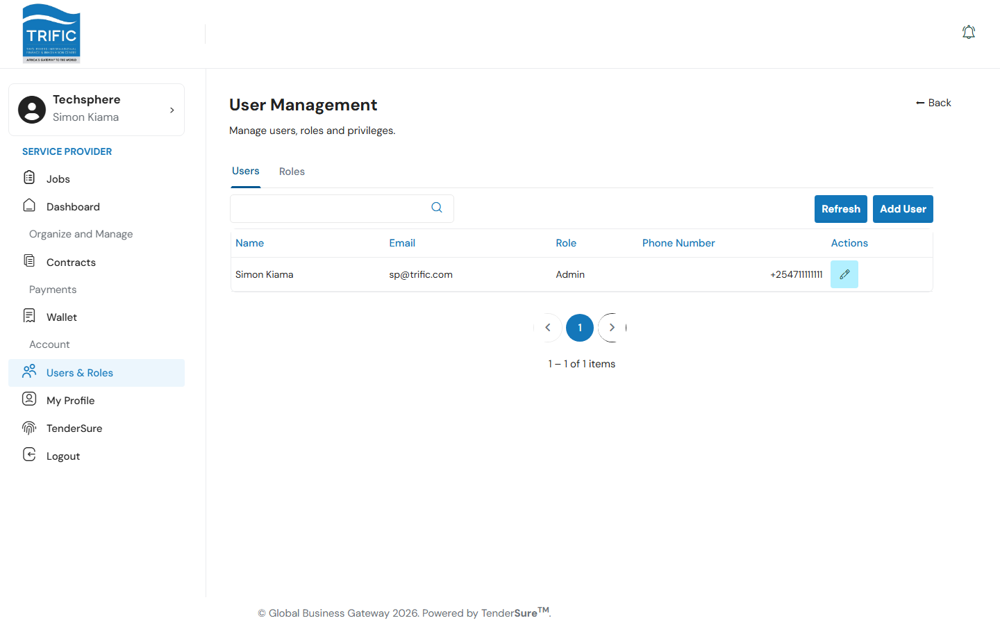
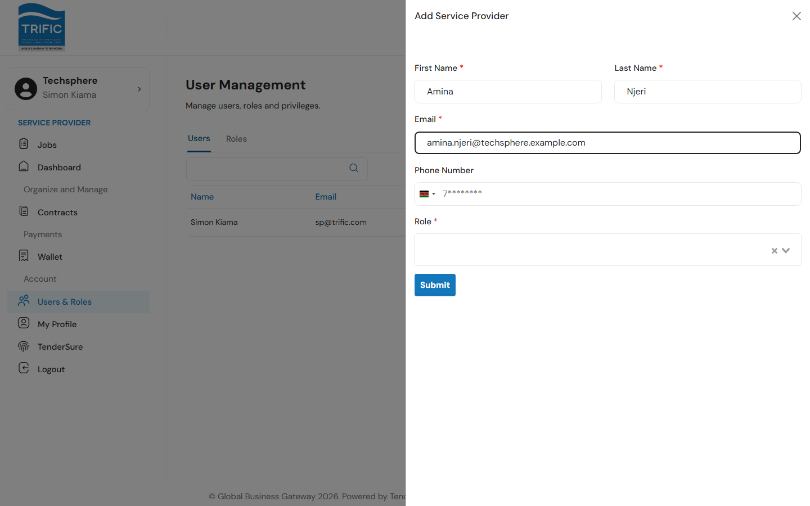
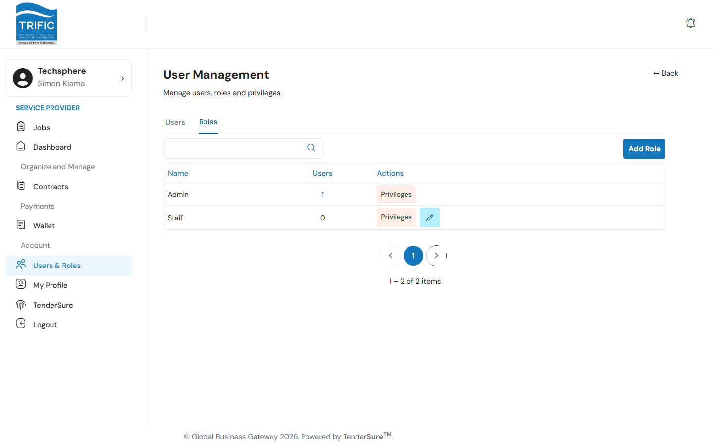
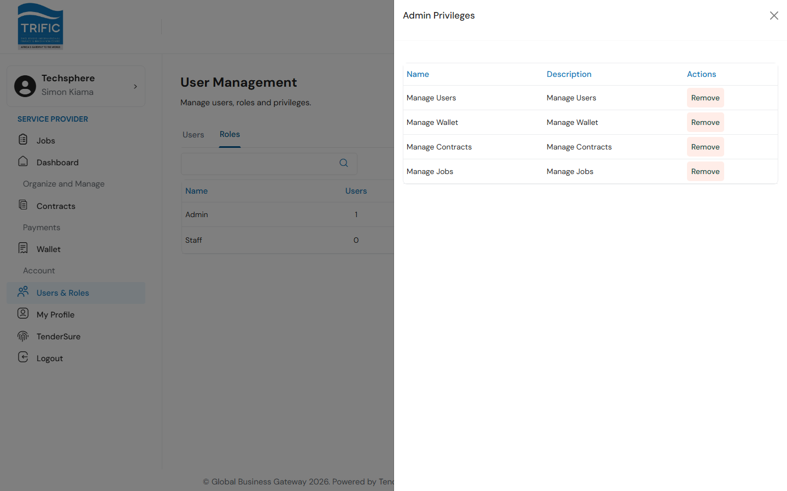

# Users & Roles

A service provider company is more than one login. **User Management** — under the left-hand menu's Account section, **Users & Roles** — is where a company admin invites teammates and controls what they can see and do in the portal. It has two tabs: **Users** and **Roles**.

## 1. Users

Lists everyone with access to your company's account: name, email, assigned role, and phone number.

Click **Add User** to open the form:

| Field | Notes |
|---|---|
| **First Name** / **Last Name** | Required, at least 2 characters each. |
| **Email** | Required, must be a valid email address. |
| **Phone Number** | Required. |
| **Role** | Required — pick from the roles your company has defined (see below). |

Submit to invite the user. Click the pencil icon on an existing row to edit their details and role. You can delete a user (trash icon) as long as your company has more than one user and you're not deleting yourself.

## 2. Roles

Roles group together privileges. Every company starts with an **Admin** role (which can't be renamed or have its privileges edited) and a **Staff** role you can customize.

- Click **Add Role** to create a new named role (minimum 3 characters), or the pencil icon on a non-Admin role to rename it.
- Click **Privileges** on any role to see and change what it can access.

## 3. Privileges

Each privilege in the list shows **Assign** or **Remove** depending on whether the role currently has it. The privileges that exist control which sections of the sidebar a user with that role can even see:

| Privilege | Unlocks |
|---|---|
| **Manage Jobs** | The **Jobs** menu item (finding and applying to work) |
| **Manage Contracts** | The **Contracts** menu item |
| **Manage Wallet** | The **Wallet** menu item |
| **Manage Users** | The **Users & Roles** menu item (this page) |

A user whose role has none of these privileges effectively only has access to their **Dashboard** and **My Profile** — so before inviting a teammate, decide which of these four areas they need and assign (or build) a role accordingly.
