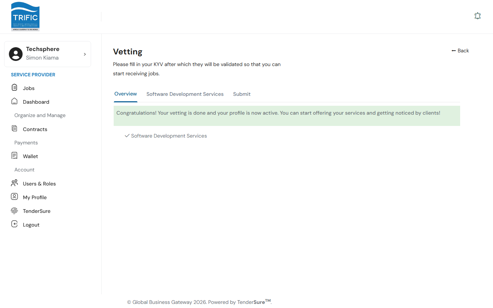
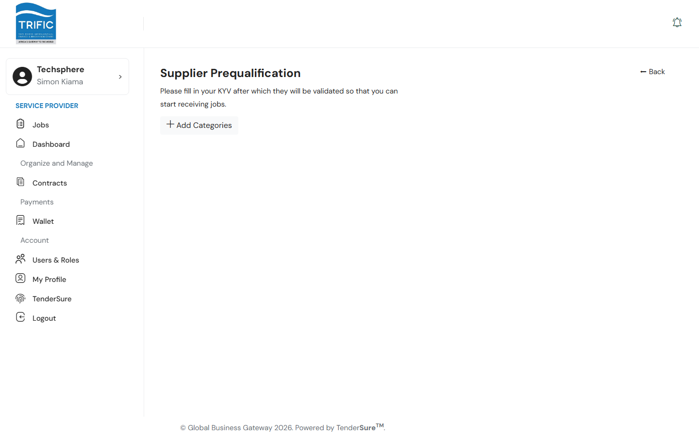
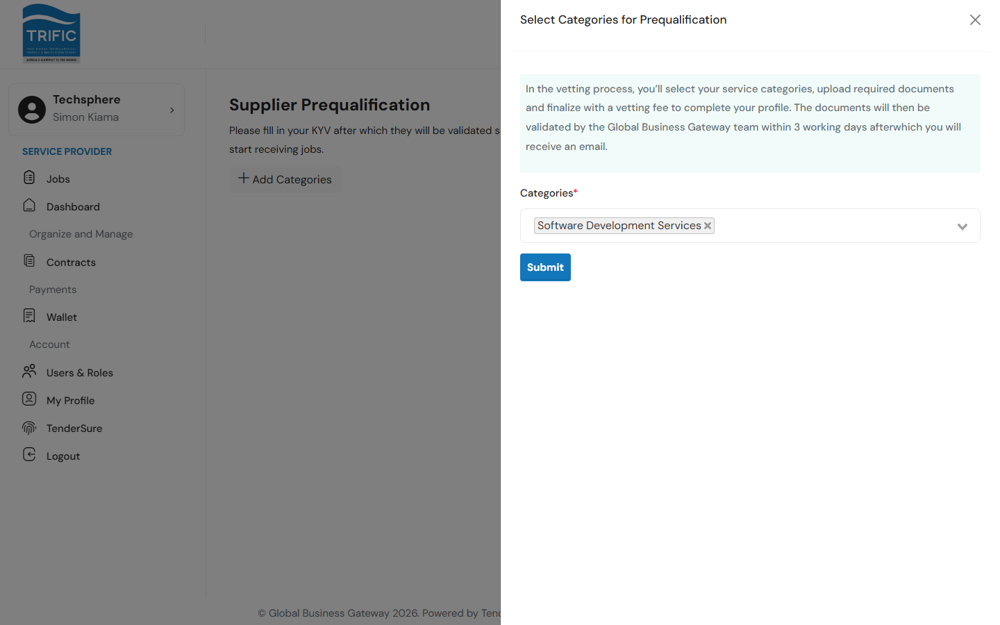

# Vetting & Onboarding Status

Before a service provider company can apply to jobs, it must be **vetted** — Trific's way of confirming who you are and which service categories you're qualified to work in. This page covers what you do in *this* portal to get vetted. It does not cover reviewing or approving vetting submissions: that happens entirely on a separate internal **TenderSure Admin** portal, operated by the Global Business Gateway/TenderSure team. From the Service Provider portal you can only submit your documents and payment, and check your own status — you can't see or influence anyone else's review queue.

## Where to find it

Vetting isn't currently linked from the left-hand sidebar menu. You reach it either automatically — right after you first sign in, if your company isn't fully vetted yet — or by navigating directly to **Vetting** (`/service-provider/vetting`).

## 1. Select your categories

The **Overview** tab is where you choose which service categories your company wants to be vetted for.

Pick one or more **Categories** from the dropdown and click **Continue**. Each category you add gets its own tab in this wizard.

## 2. Fill in each category's details

Each category tab asks for:
- Your **rate per hour** and a **brief description of the services you offer** in that category (min. 30 characters).
- Any category-specific questions the Trific team has configured — these render as text fields, dropdowns, checkboxes, yes/no questions, file uploads, numbers, dates, or long-text boxes depending on how the question is set up.
- A chance to add **Portfolio** entries for that category (see [Profile & Portfolio](profile-and-portfolio.md)).

Click **Continue** to move to the next tab.

## 3. Submit and pay

The **Submit** tab lists compliance statements you're agreeing to (accuracy of your documents, no plagiarized/AI-generated work samples passed off as original, etc.). Click **Submit** to send your application for vetting, which opens a payment panel.

Payment supports two options:
- **M-PESA** — either an STK push prompt to your phone, or Pay Bill instructions (Business No. `4119397`, with a unique account/reference code shown on screen).
- **Cards & Other Methods** — redirects to a hosted card payment page.

Once payment is confirmed, the panel shows a success message: your documents will be validated by the Global Business Gateway team, typically within **3 working days**, and you'll be notified by email.

## Checking your status

The Overview tab doubles as your status screen:

- **Pending** — you can still edit categories and documents.
- **In Progress** — your payment and documents have been submitted; the Global Business Gateway team is validating them.
- **Success** — you're fully vetted. You can now apply to jobs, and this tab shows a checklist of your approved categories instead of the submission form.

## A note on the per-category flow

There is also a **Supplier Prequalification** page (`/service-provider/prequalification`) that offers a more granular version of the same idea — add categories one at a time and pay for each individually, tracked as `Pending` / `In Progress` / `Completed` per category.

Whichever page you land on, remember: everything here is about *submitting* your qualification — the actual review and approval decision is made by the Global Business Gateway/TenderSure team on their own admin system, not in this portal.
